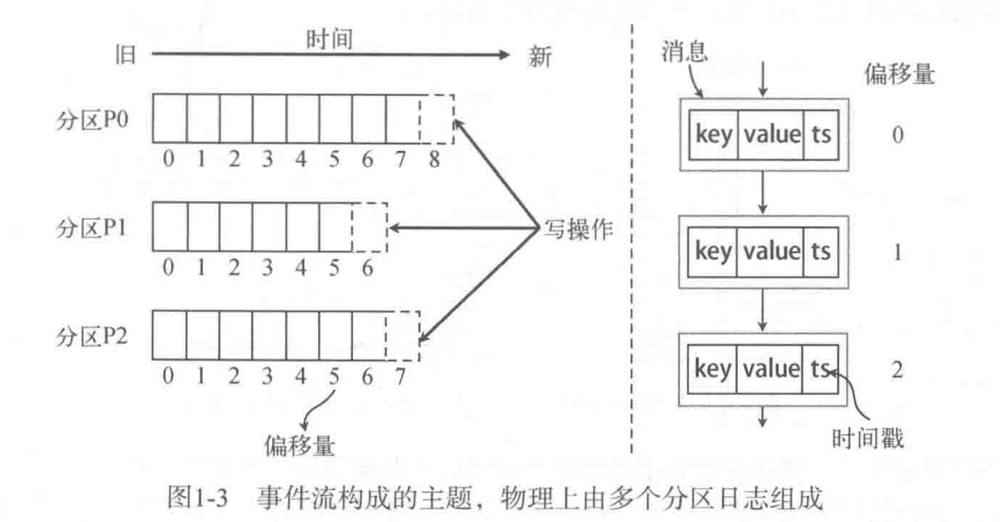
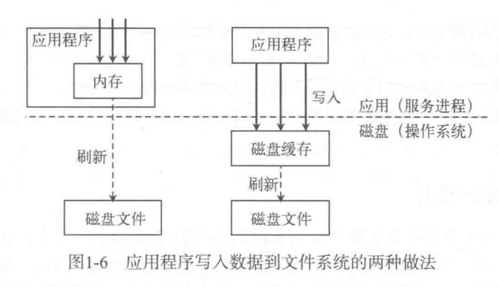

## 概念

**kafka集群**：由多个消息代理服务器组成。

**消息代理服务器**【broker server】：服务器节点。

**分区**【partition】：最小的粒度，将分区分配给消费组不同的而且是唯一的消费者，并确保一个分区只属于一个消费者

**主题**【topic】：消息的类别，不同应用产生不同类型的数据，建议设置不同的主题。一个主题一般会有多个消费者的订阅。从物理意义上可以把主题看做分区的日志文件。

**分区日志文件**：kafka集群为每个主题维护了分布式的分区日志文件。原始的消息内容和分配的偏移量以及其他一些元数据信息都会存储到分区日志文件中。

**提交日志**【commit log】：每个分区都有一个有序，不可变的记录序列，新的消息会不断追加到提交日志。

**偏移量**【offset】：分区中的每条消息都会按时间顺序分配到一个单调递增的顺序标号，即偏移量。

**消息**：包括key，消息内容和时间戳。消息有键值时，通过键值分布到同一个分区，没有键值时，通过轮询的方式发到分区。

## 分区模型



一个主题有多个分区，每个分区只能是一个消费组的一个消费者消费，保证了消息的有序性，且同一个消费组不同消费者只能消费不同的分区，保证了消息的负载均衡。

## 消费模型


拉取模式，消费者通过控制偏移量来消费消息。

不管消息有没有被消费，消息会一直存储在kafka集群中。

过期策略：设置保留时间。

## 分布式模型

每个分区都会以副本的方式复制到多个消息代理节点上。其中一个节点作为主副本【leader】。其他节点作为备份副本【follower】

主副本【leader】：负责所有客户端的读写操作。

备份副本【follower】：从主副本同步数据。

## 设计与实现

### 文件系统的持久化

**操作系统概念**

**预读**：提前将一个比较大的磁盘块读入内存。

**后写**：将很多很小的逻辑写操作合并起来组合成一个大的物理写操作。

**磁盘缓存：**操作系统将主内存剩余的所有空闲内存空间用作磁盘缓存。



kafka在存储数据时，所有的数据立即写入文件系统的持久化日志文件，首先到磁盘缓存，操作系统随后将这些数据定期自动刷新到物理磁盘。

### 数据传输效率

**零拷贝技术**：只需将磁盘文件的数据复制到页面缓存中一次，然后将数据从页面缓存直接发送到网络中。


### 生产者

**生产者将消息发送到分区主副本的过程**：

1. 生产者客户端在发送消息之前，向任意一个代理节点请求元数据，确定每条消息对应的主副本节点
2. 采用随机方式或者分区语义函数决定发布的消息归属哪个分区。

**批量发送消息集机制**：

1. 设置指定时间内收集不超过指定数量的消息。
2. 如果指定时间内达到指定数量，则立即发送，如果没有达到，也要把消息发出去。

### 消费者


**消费状态处理机制：**

1. 消费者记录每个分区的消费进度（偏移量）
2. 消费者会定时的将分区的消费进度保存成检查点文件，表示这个位置之前的消息已经被消费过了。

**消费者批量拉消息机制：**

永远处于消费状态，如果消息较少时，可以采用阻塞式，长轮询的方式等待。

### 副本机制

在多个服务器节点上对每个主题分区的日志进行复制。

**备份副本从主副本拉消息的过程：**

1. 消费方式和普通消费者一样
2. 备份副本会将消息运用到自己的本地日志文件。

### 容错机制

**节点存活状态判断**：

- 节点必须和 ZK 保持会话
- 如果这个节点是某个分区的备份副本，它必须对分区主副本的写操作进行复制，复制的进度不能落后太多。

满足上面两个条件，叫做“正在同步中”【in-sync】

**ISR**：每个分区的主副本会跟踪正在同步中的备份副本节点。

**已经提交的消息**：一条消息只有被ISR 集合中的所有副本都运用到本地的日志文件，才算成功提交了。已经提交的消息才能被消费者消费。

## 命令

**创建主题**

```shell
kafka-topics --create --bootstrap-server localhost:9092 --replication-factor 1 --partitions 1 --topic {topicname}
```

**查看主题**

```shell
kafka-topics --list --bootstrap-server localhost:9092
```

```shell
kafka-topics --describe --bootstrap-server localhost:9092 --topic {topicname}
```

**生产消息**

```shell
kafka-console-producer --broker-list localhost:9092 --topic {topicname} 
```

**消费消息**

```shell
kafka-console-consumer --bootstrap-server localhost:9092 --topic {topicname} --from-beginning
```


