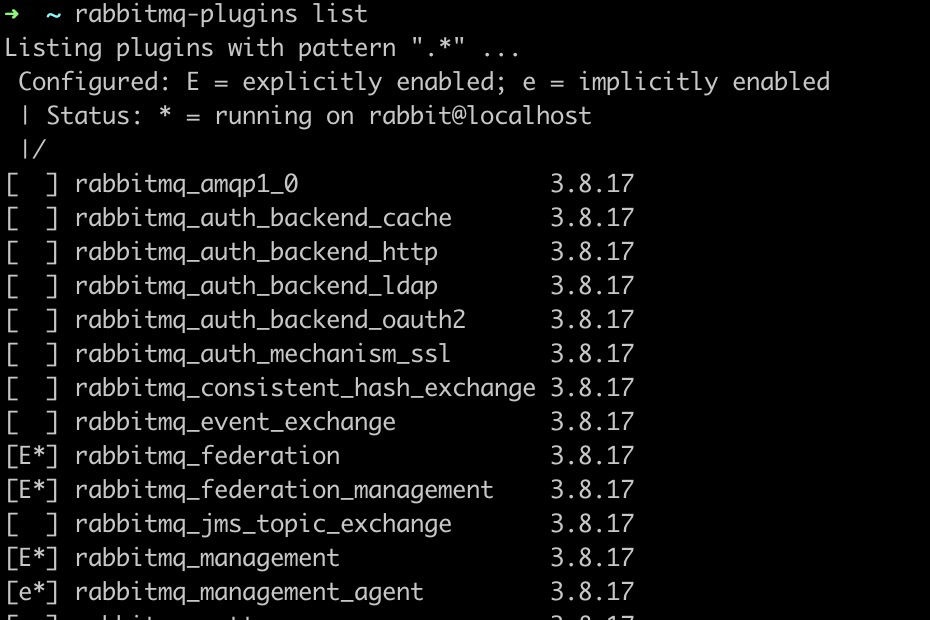

# 简介

## 消息中间件作用

> 1. 解耦。
> 2. 冗余（存储）：可以持久化数据直至处理完成，避免数据丢失。
> 3. 扩展性：容易提升消息入队和处理的效率。
> 4. 削峰。
> 5. 可恢复性：系统一部分组件失效了，不影响整个系统。处理消息的组件挂掉，加入消息中间件的消息仍然可以在组件恢复后进行处理。
> 6. 顺序保证。
> 7. 缓冲。
> 8. 异步通信。

## RabbitMQ特点

> 1. 可靠性：持久化、传输确认、发布确认。
> 2. 路由灵活。
> 3. 扩展性：集群。
> 4. 高可用性：队列可以在集群中的机器上设置镜像。
> 5. 多种协议。
> 6. 多语言客户端。
> 7. 管理界面。`http://localhost:15672/#/`
> 8. 插件机制。

# 配置

优先级：环境变量 > 配置文件 > 默认配置

## 环境变量

|          变量名          | 含义                                                         |
| :----------------------: | :----------------------------------------------------------- |
| RABBITMQ_NODE_IP_ADDRESS | node所在的ip地址                                             |
|    RABBITMQ_NODE_PORT    | 监听客户端链接的接口，默认：5672。                           |
|    RABBITMQ_DIST_PORT    | 默认内部通信端口号，默认：25762                              |
|    RABBITMQ_NODENAME     | node的名称，默认rabbit@$HOSTNAME                             |
|  RABBITMQ_CONF_ENV_FILE  | 环境变量的配置文件的路径，默认：/$RABBITMQ_HOME/etc/rabbitmq/rabbitmq-env.conf |
|  RABBITMQ_USE_LONGNAME   | boolean值，是否显示长命名，例如：rabbit@node1.xxx            |
|    RABBITMQ_CONF_FILE    | 配置文件的路径，默认：/$RABBITMQ_HOME/etc/rabbitmq/rabbitmq  |
|   RABBITMQ_MNESIA_BASE   | RABBITMQ_MNESIA_DIR的父目录，默认值：/$RABBITMQ_HOME/var/lib/rabbitmq/manesia |
|   RABBITMQ_MNESIA_DIR    | 包含rabbitmq节点的数据库，数据存储和集群状态的目录，默认值为RABBITMQ_MNESIA_BASE/RABBITMQ_NODENAME |
|    RABBITMQ_LOG_BASE     | 服务日志的目录，默认：/$RABBITMQ_HOME/var/log/rabbitmq       |
|      RABBITMQ_LOGS       | 和ERAING相关的日志，默认：RABBITMQ_LOG_BASE/RABBITMQ_NODENAME.log |
|    RABBITMQ_SASL_LOGS    | SASL相关的日志，默认：RABBITMQ_LOG_BASE/RABBITMQ_NODENAME-sasl.log |
|   RABBITMQ_PLUGINS_DIR   | 插件所在路径，默认：/$RABBITMQ_HOME/plugins/                 |

## 配置文件

### 配置项

|                     变量名                     | 含义                                                         |
| :--------------------------------------------: | ------------------------------------------------------------ |
|                 tcp_listeners                  | 监听 AMQP 连接，可以配置为端口号或者端口号与主机名组成的元组。 |
|               num_tcp _acceptors               | 用来处理tcp连接的Erlang进程数目，默认：10                    |
|               handshake_timeout                | TCP握手超时时间，默认：100000                                |
|                 ssl_Iisteners                  | 同tcp_listeners，默认[]。                                    |
|               num_ssl _acceptors               | 用来处理ssl连接的Erlang进程数目，默认：1                     |
|                  ssl_options                   | ssl配置，默认为[]。                                          |
|             ssl_handshake_timeout              | ssl握手超时时间，默认5000.                                   |
|            vm_memory_high_watermark            | 触发流量控制的内存阈值。默认值为0.4。                        |
|         vm_memory_calculation_strategy         | 内存使用的报告方式。 共有<br/>( 1) rss: 采用操作系统的 RSS 的内存报告<br/>( 2 ) erlang: 采用 erlang 的内存报告<br/>默认值为 rss |
|     vm_memory_high_watermark_paging_ratio      | 内存高水位的百分比阈值，当达到阈值时，队列开始将消息持久化到磁盘以释放内 存。默认为0.5。 |
|                disk_free_limit                 | 存储数据分区的可用磁盘空间限制。当可用空间值低于阈值时，流程控制将被触发。 |
|                   log_levels                   | 日志等级：<br/>（1）channel：所有与 AMQP 信道相关的日志<br/>（2）connection：所有与连接相关的日志<br/>（3）federation：所有 federation 关的日志<br/>（4）mirroring：所有与镜像相关的日志<br/>日志级别有 5 种: <br/>none：表示不记录日志事件; <br/>error：表示只记录错误;<br/>wraning：只记录错误和告警;<br/>info：表示记录错误、告警和信息; <br/>debug：表示记录错误、告警信息和调试信息。<br/>默认值为[{connection. info}]。 |
|                    framemax                    | 与客户端协商的允许最大帧大小，单位为B，0为无限制。默认131072。 |
|                  channel_max                   | 与客户端协商的允许最大信道个数，0为无限制。默认为0。         |
|           channel_operation_timeout            | 信道运行的超时时间，单位为毫秒，默认值为15000。              |
|                   heartbeat                    | 服务端与客户端连接的心跳延时，单位为秒。默认60，0为禁用心跳。 |
|                 default_vhost                  | 默认的vhost，默认为"\\"。                                    |
|                  default_user                  | 默认的用户，默认为guest。                                    |
|                  default_pass                  | 默认的密码，默认为guest。                                    |
|              default _user _tags               | 默认的角色，默认为administastor。                            |
|              default_permissions               | 默认的权限，默认[<<".*"> <<".*">>, <<".*">>]                 |
|                 loopback_users                 | 设置只能通过本地网络(如 localhost) 来访问 Broker 的用 户列表。默认值为<<"guest">> |
|                 cluster_nodes                  | 可以用来配置集群。二元组，一个是要加入集群的节点名称，一个是节点类型。 |
|               server_properties                | 连接时向客户端声明的键值对列表。默认值为[]。                 |
|               collect_statistics               | 统计数据的收集模式，主要与RabbitMQ Management插件相关，共有3个值可选<br/>（1）none：不发布统计事件<br/>（2）coarse：发布每个队列/信道/连接的统计事件<br/>（3）fme：同时还发布每个消息的统计事件<br/>默认值为 none |
|          collect_statistics_interval           | 统计数据的收集时间间隔，主要与 RabbitM Management 插件相关。默认值为 5000。 |
|         management_db_cache_multiplier         | 设置管理插件将缓存代价较高的查询的时间。缓存将把最后一个查询的运行时间乘 以这个值，并在此时间内缓存结果。默认值为5。 |
|                 delegate_count                 | 内部集群通信中，委派进程的数目。在拥有很多个内核并且是集群中的一个节点的机器上可以增加此值。默认是16。 |
|               tcp_listen_options               | 默认的 socket 选项。                                         |
|                  hipe_compile                  | 将此值设置为true，就可以开启 HiPE 功能，即 Erlang 的即时编译器。 |
|           cluster_partition_handling           | 如何处理网络分区。                                           |
|           cluster_keepalive_interval           | 向其他节点发送存活消息的频率。单位为毫秒。默认100000。       |
|          queue_index_embed_msg_below           | 消息的大小，小于此值时会直接嵌入到队列的索引中。单位为B，默认值为4096。 |
|             msg_store_index_module             | 队列索引的实现模块。                                         |
|              backing_queue_module              | 队列内容的实现模块。默认为rabbit_variable_queue。不建议修改此项。 |
|        mnesia_table_loading_retry_limit        | 等待集群中 Mnesia 数据表可用时最大的重试次数，默认值为10。   |
|       mnesia_table_loading_retry_timeout       | 每次重试时，等待集群中 Mnes 数据表可用时的超时时间。默认值为 30000。 |
|              queue_master_locator              | 队列的定位策略。                                             |
| lazy_queue_explicit_gc_run_operation_threshold | 在使用惰性队列（lazy queue）时进行内存回收动作的阀值。默认值为1000。 |
|   queue_explicit_gc_run_operation_threshold    | 在使用正常队列时进行内存回收动作的阀值。默认值为1000。       |

### 网络配置

|            参数项            | 描述                                                         |
| :--------------------------: | ------------------------------------------------------------ |
|  tcp_listen_options.nodelay  | 默认true，禁用Nagle算法。                                    |
|  tcp_listen_options.sndbuf   | tcp缓冲区大小，提高消费者的吞吐量                            |
|  tcp_listen_options.recbuf   | tcp缓冲区大小，提高发送者的吞吐量                            |
|  tcp_listen_options.backlog  | 队列中未接受连接的最大数目。                                 |
|  tcp_listen_options.linger   | 当套接字关闭时。用于设置刷新未发送数据的超时时间，单位为秒。 |
| tcp_listen_options.keepalive | 长连接。                                                     |

# 节点

> broker。mq实例，一般是一台服务器。
>
> [参考代码](rabbitmq-shizhanzhinan-exercises/src/main/java/com/normal)

- **远程登录**

  > 修改rabbitmq-env.conf，NODE_IP_ADDRESS 置为空，[详见](https://blog.csdn.net/dongzhensong/article/details/88249834)。

- **HTTPAPI接口管理**

  > [api文档](http://localhost:15672/api/index.html)：http://localhost:15672/api/index.html

## 基本操作

**rabbitmqctl**

```shell
rabbitmqctl [-n node] [-t timeout] [-q] {command} [command options...]
```

> **大括号代表必选**。**中括号代表可选**。...**代表多值**。
>
> 1. node：默认节点是rabbitmq@hostname。
> 2. timeout：操作超时时间，只用于「list_XXX」的命令。默认无穷大。
> 3. q：以静默模式启动，屏蔽一些消息的输出。默认不开启。

## 管理

- **查看状态**

  ```shell
  rabbitmqctl status
  ```

  > ```shell
  > Status of node rabbit@localhost ...
  > Runtime
  > 
  > OS PID: 97385
  > OS: macOS
  > Uptime (seconds): 27
  > Is under maintenance?: false
  > RabbitMQ version: 3.8.17
  > Node name: rabbit@localhost
  > Erlang configuration: Erlang/OTP 24 [erts-12.0.2] [source] [64-bit] [smp:8:8] [ds:8:8:10] [async-threads:1] [jit] [dtrace]
  > Erlang processes: 463 used, 1048576 limit
  > Scheduler run queue: 1
  > Cluster heartbeat timeout (net_ticktime): 60
  > 
  > Plugins
  > 
  > Enabled plugin file: /usr/local/etc/rabbitmq/enabled_plugins
  > Enabled plugins:
  > 
  >  * rabbitmq_stomp
  >  * rabbitmq_mqtt
  >  * rabbitmq_amqp1_0
  >  * amqp10_common
  >  * rabbitmq_management
  >  * amqp_client
  >  * rabbitmq_web_dispatch
  >  * cowboy
  >  * cowlib
  >  * rabbitmq_management_agent
  > 
  > Data directory
  > 
  > Node data directory: /usr/local/var/lib/rabbitmq/mnesia/rabbit@localhost
  > Raft data directory: /usr/local/var/lib/rabbitmq/mnesia/rabbit@localhost/quorum/rabbit@localhost
  > 
  > Config files
  > 
  > 
  > Log file(s)
  > 
  >  * /usr/local/var/log/rabbitmq/rabbit@localhost.log
  >  * /usr/local/var/log/rabbitmq/rabbit@localhost_upgrade.log
  > 
  > Alarms
  > 
  > (none)
  > 
  > Memory
  > 
  > Total memory used: 0.1537 gb
  > Calculation strategy: rss
  > Memory high watermark setting: 0.4 of available memory, computed to: 3.436 gb
  > 
  > reserved_unallocated: 0.0726 gb (47.19 %)
  > code: 0.0368 gb (23.95 %)
  > other_proc: 0.0353 gb (22.94 %)
  > other_system: 0.0166 gb (10.79 %)
  > other_ets: 0.0037 gb (2.4 %)
  > plugins: 0.0035 gb (2.3 %)
  > atom: 0.0015 gb (0.95 %)
  > metrics: 2.0e-4 gb (0.16 %)
  > binary: 2.0e-4 gb (0.15 %)
  > mgmt_db: 2.0e-4 gb (0.12 %)
  > queue_procs: 2.0e-4 gb (0.1 %)
  > mnesia: 1.0e-4 gb (0.08 %)
  > quorum_queue_procs: 1.0e-4 gb (0.07 %)
  > msg_index: 1.0e-4 gb (0.06 %)
  > quorum_ets: 1.0e-4 gb (0.03 %)
  > connection_other: 0.0 gb (0.0 %)
  > allocated_unused: 0.0 gb (0.0 %)
  > connection_channels: 0.0 gb (0.0 %)
  > connection_readers: 0.0 gb (0.0 %)
  > connection_writers: 0.0 gb (0.0 %)
  > queue_slave_procs: 0.0 gb (0.0 %)
  > 
  > File Descriptors
  > 
  > Total: 6, limit: 7071
  > Sockets: 0, limit: 6361
  > 
  > Free Disk Space
  > 
  > Low free disk space watermark: 0.05 gb
  > Free disk space: 392.3006 gb
  > 
  > Totals
  > 
  > Connection count: 0
  > Queue count: 6
  > Virtual host count: 3
  > 
  > Listeners
  > 
  > Interface: [::], port: 15672, protocol: http, purpose: HTTP API
  > Interface: [::], port: 1883, protocol: mqtt, purpose: MQTT
  > Interface: [::], port: 61613, protocol: stomp, purpose: STOMP
  > Interface: [::], port: 25672, protocol: clustering, purpose: inter-node and CLI tool communication
  > Interface: 127.0.0.1, port: 5672, protocol: amqp, purpose: AMQP 0-9-1 and AMQP 1.0
  > ```

- **启动**

  ```shell
  rabbitmq-server -detached
  ```

  > detached：以守护进程的方式在后台运行。

- **停止运行 `Erlang` 虚拟机和服务应用**

  ```shell
  rabbitmqctl stop [pid_file]
  ```

  > pid_file：通过rabbitmq-server启动生成的文件，加`-detached`不产生。意思为需要等待指定进程的结束。

- **停止运行：阻塞直到 `Erlang` 虚拟机进程退出。**

  ```shell
  rabbitmqctl shutdown
  ```

- **停止服务应用**

  ```shell
  rabbitmqctl stop_app
  ```

- **启动服务应用**

  ```shell
  rabbitmqctl start_app
  ```

- **等待rabbitmq应用的启动**

  ```shell
  rabbitmqctl wait [pid_file]
  ```

- **初始化服务**

  ```shell
  rabbitmqctl reset
  ```

- **强制初始化服务**

  ```shell
  rabbitmqctl force_reset
  ```

- **切割日志**

  ```shell
  rabbitmqctl rotate_logs {suffix}
  ```

- **将部分代码用HiPE编译**

  ```shell
  rabbitmqctl hipe_compile {directory}
  ```

- **节点状态**

  ```shell
  rabbitmqctl status
  ```

- **健康检查**

  ```shell
  rabbitmqctl node_health_check
  ```

- **查看变量的名称和值**

  ```shell
  rabbitmqctl report [> report.txt]
  ```

- **生成服务器状态报告**

  ```shell
  rabbitmqctl report [> report.txt]
  ```

  > 为所有服务器状态生成1个服务器状态报告，并将输出重定向到1个文件。

- **执行任意 Erlang 表达式**

  ```shell
  rabbitmqctl eval {expr}
  ```

  > - 创建交换器：`declare(XName , Type , Durable , AutoDelete , Internal, Args)`。
  >
  > - 创建队列：`declare(QueueName , Durable , AutoDelete , Args, Owner)`。
  >
  >   > Owner：用于队列的独占模式， 一般设置为 none。

### 内存管理

- **内存阈值设置**

  > 1. **内存告警**：当内存达到阈值时，会阻塞所有生产者的连接。
  > 2. fraction默认0.4，不建议取值超过0.7。
  > 3. fraction设置为0，所有生产者都停止发送消息。
  > 4. 在 mq 无法识别所在操作系统时，会认为内存大小为1GB，如果 fraction=0.4，内存阈值就约为410MB 。
  > 5. 如果操作系统本身的内存大小为 8GB ，可以设置 fraction 大于1，当设置成 3 时，内存阈值就提高到了 3GB。

  ```shell
  [
    {
      rabbit, [
      {vm_memory_high_watermark, fraction}
      ]
    }
  ]
  # or
  rabbitmqctl set_vm_memory_high_watermark {fraction}
  ```

  > 相对值

  ```shell
  [
    {
      rabbit, [
      {vm_memory_high_watermark,  {absolute , memoryLimit}}
      ]
    }
  ]
  # or
  rabbitmqctl set_vm_memory_high_watermark absolute {memory_limit)
  ```

  > 绝对值，memoryLimit可以带单位，例如MIB，也可以写成数字，单位默认是B

- **内存换页动作阈值**

  >1. ratioFraction 默认值0.5，内存使用达到 `fraction*ratioFraction`，会进行换页动作。
  >2. ratioFraction大于1，会禁用换页功能。

  ```shell
  [
    {
      rabbit, [
      {vm_memory_high_watermark_paging_ratio, ratioFraction}
      {vm_memory_high_watermark, fraction}
      ]
    }
  ]
  ```

### 磁盘管理

- **磁盘阈值**

  > 1. 默认阈值为50MB，低于阈值，生产者会停止发消息。
  > 2. 建议 ratioFraction 为1.0 ~ 2.0。

  ```shell
  [
    {
      rabbit, [
      {disk_free_limit, {mem_relative, ratioFraction}}
      ]
    }
  ]
  # or
  rabbitmqctl set_disk_free_limit {disk_limit} 
  ```

  > 相对值，ratioFraction 是剩余磁盘和内存的比值

  ```shell
  [
    {
      rabbit, [
      {disk_free_limit, fraction}
      ]
    }
  ]
  # or
  rabbitmqctl set_disk_free_limit mem_relative {fraction}
  ```

  > 绝对值

### 流控管理

#### 原理

> 基于信用证算法【credit-based algorithm】

1. 通过监控各个进程的进程邮箱，当某个进程负载过高而来不及处理消息时，这个进程的进程邮箱就会开始堆积消息 。

2. 当堆积到一定量时，就会阻塞而不接收上游的新消息。

3. 慢慢的，上游进程的进程邮箱也会开始堆积消息 。

4. 当堆积到一定量时也会阻塞而停止接收上游的消息。

5. 最后就会使负责网络数据包接收的进程阻塞而暂停接收新的数据。


#### 流控链


> - rabbit_reader： connection的处理进程，负责接收、解析 AMQP 协议数据包等。
>
> - rabbit_channel：channel 的处理进程， 负责处理 AMQP 协议的各种方法、进行路由解析等。
>
> - rabbit_amqqueue_process：队列的处理进程，负责实现队列的所有逻辑。
>
> - rabbit_msg_store：负责实现消息的持久化。

#### 瓶颈定位

> 进程触发流控时会处于flow状态。

- connection处于flow状态，没有channel处于flow状态：性能瓶颈在channel，例如：**发送大量较小的非持久化消息。**
- connection处于flow状态，若干channel处于flow状态，没有队列处于flow状态：性能瓶颈在queue，例如：**发送大量较小的持久化消息。**
- connection处于flow状态，若干channel处于flow状态，若干队列处于flow状态：性能瓶颈在消息持久化，例如：**发送大量较大的持久化消息。**

#### 性能提升

> 瓶颈大多发生在rabbit_amqqueue_process，可以对队列进行物理分区。

> [参考代码](rabbitmq-shizhanzhinan-exercises/src/main/java/com/queuePartition)

### 参数管理

#### vhost级别

- **添加参数**

  ```shell
  rabbitmqctl set_parameter [-p vhost] {component_name} {name} {value}
  ```

- **查看参数**

  ```shell
  rabbitmqctl list_parameters [-p vhost]
  ```

- **删除参数**

  ```shell
  rabbitmqctl clear_parameter [-p vhost] {component_name} {key}
  ```

#### global级别

- **添加参数**

  ```shell
  rabbitmqctl set_global_parameter {name} {value}
  ```

- **查看参数**

  ```shell
  rabbitmqctl list_global_parameters [-p vhost]
  ```

- **删除参数**

  ```shell
  rabbitmqctl clear_global_parameter {key}
  ```

### 策略管理

> vhost级别，可以匹配一个或多个交换器，可以支持动态修改一些参数属性

- **添加策略**

  ```shell
  rabbitmqctl set_policy [-p vhost] [--priority priority] [--apply-to apply-to] {name} {pattern} {definition}
  ```

  > 1. priority：优先级，多个策略优先级高的执行。
  > 2. apply-to：应用到交换器或队列。
  > 3. name：策略名称。
  > 4. pattern：匹配的交换器或队列的正则。
  > 5. definition：参数，格式： {"key": "value"}

- **查看策略**

  ```shell
  rabbitmqctl list_policies 
  ```

- **删除策略**

  ```shell
  rabbitmqctl clear_policy [-p vhost] {name}
  ```

## 配置

> 优先级：环境变量 > 配置文件 > 默认配置

### 环境变量

|          变量名          | 含义                                                         |
| :----------------------: | :----------------------------------------------------------- |
| RABBITMQ_NODE_IP_ADDRESS | node所在的ip地址                                             |
|    RABBITMQ_NODE_PORT    | 监听客户端链接的接口，默认：5672。                           |
|    RABBITMQ_DIST_PORT    | 默认内部通信端口号，默认：25762                              |
|    RABBITMQ_NODENAME     | node的名称，默认rabbit@$HOSTNAME                             |
|  RABBITMQ_CONF_ENV_FILE  | 环境变量的配置文件的路径，默认：/$RABBITMQ_HOME/etc/rabbitmq/rabbitmq-env.conf |
|  RABBITMQ_USE_LONGNAME   | boolean值，是否显示长命名，例如：rabbit@node1.xxx            |
|    RABBITMQ_CONF_FILE    | 配置文件的路径，默认：/$RABBITMQ_HOME/etc/rabbitmq/rabbitmq  |
|   RABBITMQ_MNESIA_BASE   | RABBITMQ_MNESIA_DIR的父目录，默认值：/$RABBITMQ_HOME/var/lib/rabbitmq/manesia |
|   RABBITMQ_MNESIA_DIR    | 包含rabbitmq节点的数据库，数据存储和集群状态的目录，默认值为RABBITMQ_MNESIA_BASE/RABBITMQ_NODENAME |
|    RABBITMQ_LOG_BASE     | 服务日志的目录，默认：/$RABBITMQ_HOME/var/log/rabbitmq       |
|      RABBITMQ_LOGS       | 和ERAING相关的日志，默认：RABBITMQ_LOG_BASE/RABBITMQ_NODENAME.log |
|    RABBITMQ_SASL_LOGS    | SASL相关的日志，默认：RABBITMQ_LOG_BASE/RABBITMQ_NODENAME-sasl.log |
|   RABBITMQ_PLUGINS_DIR   | 插件所在路径，默认：/$RABBITMQ_HOME/plugins/                 |

# 连接

> `Connection` 可以用来创建多个 `Channel` 实例。
>
> `Channel`实例不能线程间共享，每个线程应该创建一个 `Channel` 实例。

## 管理

```shell
rabbitmqctl list_connnects [connectionInfoItem...]
```

> 默认显示user、peer_host、peer_port和state。
>
> 1. pid：与连接相关的 `Erlang` 进程 ID。
> 2. name：连接的名称。
> 3. port：服务器端口。
> 4. host：返回反向 DNS 获取的服务器主机名称，或者 IP 地址，或者未启用。
> 5. peer_port：服务器对端端口。当一个客户端与服务器连接时，这个客户端的端口就peer_port。
> 6. peer_host：返回反向 DNS 获取的对端主机名称，或者 地址，或者未启用。
> 7. ssl：是否启用 SSL。
> 8. ssl_protocol：SSL 协议，如 tlsvl。
> 9. ssl_key_exchange：SSL 密钥交换算法，如 rsa。
> 10. ssl_cipher：SSL 加密算法，如 aes_256_cbc。
> 11. ssl_hash: SSL 哈希算法，如 sha。
> 12. peer_cert_subject：对端的 SSL 安全证书的主题，基于RFC4514 的形式。
> 13. peer_cert_issuer：对端 SSL 安全证书的发行者， 基于 RFC4514 的形式
> 14. peer_cert_validity：对端 SSL 安全证书的有效期。
> 15. state：连接状态，包括 starting、tuning、opening、running、flow、blocking、blocked、closing、closed 这几种。
> 16. channels：该连接中的信道个数。
> 17. protocol：使用的 AMQP 协议的版本，当前是 {0.9.1} 或者 {0.8.0} 。注意，如果客户端请求的是 AMQP 0.9 的连接， RabbitMQ 也会将其视为0.9.1。
> 18. auth_mechanism：使用的 SASL 认证机制，如 PLAIN、AMQPLAIN、EXTERNAL、RABBIT-CR-DEMO。
> 19. user：与连接相关的用户名。
> 20. vhost：与连接相关的 vhost 的名称。
> 21. timeout：连接超时/协商的心跳间隔，单位为秒。
> 22. frame_max：最大传输帧的大小，单位为B。
> 23. channel_max：此连接上信道的最大数量。如果值 0，则表示无上限，但客户端会将0转变为 65535。
> 24. client_properties：在建立连接期间由客户端发送的信息属性。
> 25. recv_oct：收到的字节数。
> 26. recv_cnt：收到的数据包个数。
> 27. send_oct：发送的字节数。
> 28. send_cnt：发送的数据包个数。
> 29. send_pend：发送队列大小。
> 30. connected_at：连接建立的时间戳。

## 配置

### tcp配置

文件配置：rabbitmq.conf

|        参数项         | 描述                                                         |
| :-------------------: | ------------------------------------------------------------ |
|     tcp_listeners     | 监听 AMQP 连接，可以配置为端口号或者端口号与主机名组成的元组。 |
|  num_tcp _acceptors   | 用来处理tcp连接的Erlang进程数目，默认：10                    |
|   handshake_timeout   | TCP握手超时时间，默认：100000                                |
|     ssl_Iisteners     | 同tcp_listeners，默认[]。                                    |
|  num_ssl _acceptors   | 用来处理ssl连接的Erlang进程数目，默认：1                     |
|      ssl_options      | ssl配置，默认为[]。                                          |
| ssl_handshake_timeout | ssl握手超时时间，默认5000.                                   |
|  tcp_listen_options   | 默认的 socket 选项。                                         |

### 网络配置

|            参数项            | 描述                                                         |
| :--------------------------: | ------------------------------------------------------------ |
|  tcp_listen_options.nodelay  | 默认true，禁用Nagle算法。                                    |
|  tcp_listen_options.sndbuf   | tcp缓冲区大小，提高消费者的吞吐量                            |
|  tcp_listen_options.recbuf   | tcp缓冲区大小，提高发送者的吞吐量                            |
|  tcp_listen_options.backlog  | 队列中未接受连接的最大数目。                                 |
|  tcp_listen_options.linger   | 当套接字关闭时。用于设置刷新未发送数据的超时时间，单位为秒。 |
| tcp_listen_options.keepalive | 长连接。                                                     |

# 信道

> 每个信道都会被指定一个唯一的ID。
>
> 是建立在连接上的虚拟信道。
>
> 多线程间复用TCP连接，起到节省作用。

### AMQP协议

#### 协议层

> 1. Module Layer：协议最高层，定义供客户端调用的命令。
> 2. Session Layer：
>    1. 中间层，负责将客户端的命令发送给服务器，将应答返回给客户端。
>    2. 为客户端与服务端之间的通信提供可靠性同步机制和错误处理。
> 3. Transport Layer：最底层，负责传输二进制数据流。

## 管理

```shell
rabbitmqctl list_channels [channelInfoItem...]
```

> 默认显示 pid、user、consumer_count、messages_unacknowledged。
>
> 1. pid：与连接相关的 `Erlang` 进程 ID。
> 2. connection：信道所属连接的  `Erlang` 进程 ID。
> 3. name：信道的名称。
> 4. number：信道的序号。
> 5. user：与信道相关的用户名称。
> 6. vhost：与信道相关的vhost。
> 7. transactional：信道是否处于事务模式。
> 8. confirm：信道是否处于 publisher confirm 模式。
> 9. consumer_count：信道中的消费者的个数。
> 10. messages_unacknowledged：已投递但是还未被 ack 的消息个数。
> 11. messages_uncommitted：已接收但是还未提交事务的消息个数。
> 12. acks_uncommitted：已 ack 收到但是还未提交事务的消息个数。
> 13. messages_unconfirmed：己发送但是还未确认的消息个数。 如果信道不处于 publisher confmn 模式下 ，则此值为0。
> 14. perfetch_count：新消费者的 Qos 个数限制。0表示无上限。
> 15. global_prefetch_count：整个信道的 Qos 个数限制。0表示无上限。

# 虚拟主机

> 本质上是一个独立的小型rabbitmq服务器。
>
> vhost之间绝对隔离。
>
> 客户端连接时必须指定一个vhost【默认「/」】。
>
> 用户可以拥有多个虚拟主机的权限。

## 管理

- **创建**

  ```shell
  rabbitmqctl add_vhost {vhostName}
  ```

- **查看**

  ```shell
  rabbitmqctl list_vhosts [vhostinfoitem...]
  ```

  > 1. vhostinfoitem取值有两个，代表结果要展示的列。
  > 2. name：vhost名称。
  > 3. tracing：表示是否使用了trace功能。

- **删除**

  ```shell
  rabbitmqctl delete_vhost {vhostName}
  ```

## 配置

文件配置：rabbitmq.conf

|    变量名     | 含义                      |
| :-----------: | ------------------------- |
| default_vhost | 默认的vhost，默认为"\\"。 |

# 用户

> 权限控制以vhost为单位。

## 管理

### 用户管理

- **创建**

  ```shell
  rabbitmqctl add_user {userName} {password}
  ```

- **修改密码**

  ```shell
  rabbitmqctl change_password {userName} {newPassword}
  ```

- **清除密码**

  ```shell
  rabbitmqctl clear_password {userName}
  ```

- **密码验证**

  ```shell
  rabbitmqctl authenticate_user {userName} {password}
  ```

- **删除**

  ```shell
  rabbitmqctl delete_user {userName}
  ```

- **查看列表**

  ```shell
  rabbitmqctl list_users
  ```

  > 每个结果行都包含用户的名称和用户的角色【tags】，角色如下：
  >
  > 1. none：无任何角色。新创建的用户的角色默认为none。
  > 2. management：可访问web管理页面。
  > 3. policymaker：包括management的所有权限，并且可以管理策略和参数。
  > 4. monitoring：包括management的所有权限，并且可以看到连接、信道及节点相关信息。
  > 5. administartor：包括monitoring的所有权限，并且可以管理用户，虚拟主机，权限，策略，参数等。代表最高权限。

- **设置用户角色**

  ```shell
  rabbitmqctl set_user_tags {userName} {tags...}
  ```

### 权限管理

- **授予权限**

  ```shell
  rabbitmqctl set_permissions [-p host] {user} {conf} {write} {read}
  ```

  > 1. user：可以访问指定vhost的用户名。
  >
  > 2. conf：可配置权限的正则表达式，用于匹配资源。指的是队列和交换器的创建及删除之类的操作。
  >
  > 3. write：可写权限的正则表达式，用于匹配资源。指的是发布消息。
  >
  > 4. Read：可读权限的正则表达式，用于匹配资源。指的是与消息有关的操作。
  >
  > 5. 命令与权限的映射关系：
  >
  >    

- **清除权限**

  ```shell
  rabbitmqctl clear_permissions [-p host] {userName}
  ```

- **虚拟主机纬度的权限信息**

  ```shell
  rabbitmqctl list_permissions [-p host]
  ```

- **用户纬度的权限信息**

  ```shell
  rabbitmqctl list_user_permissions {userName}
  ```

# 交换器

> 1. 生产者将消息发送到交换器，由交换器将消息路由到一个或多个队列。
> 2. 建议通过后台管理系统预先创建资源。

## 类型

- **fanout**

  > 把所有发送到该交换机的消息路由到所有与该交换器绑定的队列中。
  >

- **direct**

  > 把消息路由到 BingdingKey 和 RoutingKey完全匹配的队列中。

- **topic**

  > 把消息路由到  BingdingKey 和 RoutingKey 相匹配的队列中。
  >
  > 1. BingdingKey和RoutingKey 都是以`.`分隔的字符串。每一段称为一个单词。
  >
  > 2. BingdingKey存在两种特殊字符串，用于做模糊匹配。
  >
  >    - `*`：匹配一个单词。
  >
  >    - `#`：匹配多个单词。

- **headers**

  > 1. 不依赖路由键的匹配规则。依赖headers属性。
  > 2. 在绑定队列和交换器时制定一组键值对。
  > 3. 对比消息中的headers是否完全匹配队列和交换器绑定时指定的键值对。
  > 4. 性能很差，基本不用。

## 基本操作

- **声明**

  ```java
  Exchange.DeclareOk exchangeDeclare(
   	String exchange,
    BuiltinExchangeType type,
    boolean durable,
    boolean autoDelete,
    boolean internal,
    Map<String, Object> arguments
  ) throws IOException;
  ```

  > 1. exchange：交换器名称。
  > 2. type：交换器类型，fanout、direct、topic等。
  > 3. durable：是否持久化。true为持久化，将交换器存盘。不持久化的影响：rabbitmq重启时，交换器元数据会丢失，消息不会丢失，且不能将消息再发送给这个交换器了。
  > 4. autoDelete：自动删除。true为当所有绑定队列都不在使用时，自动删除交换器。【**一次性**】
  >    1. 前提：必须有交换机或队列绑定过。
  >    2. 所有绑定都断开时，自动删除。
  > 5. internal：是否设置成内置的。true为必须通过交换器路由到此交换器。
  > 6. arguments：结构化参数。
  >    1. 备份交换器：alternate-exchange

- **删除**

  ```java
  DeleteOk exchangeDelete(
    String exchange
  ) throws IOException;
  ```

## 实践

### 备份交换器

> Alternate Exchange
>
> [参考代码](rabbitmq-shizhanzhinan-exercises/src/main/java/com/ae)

- **适用场景**

  1. 当 `mandatory` 为false时，不会将未匹配到的消息返回给生产者，此时可使用备份交换器。

  2. 当使用备份交换器时，`mandatory` 参数不生效。

- **使用方式**

  ```java
  args.put("alternate-exchange", "备份交换器名称");
  ```

  > 声明主交换器时将参数传入

  ```shell
  rabbitmqctl set_policy AE "^主交换器名称$" `{"alternate-exchange": "备份交换器名称"}`
  ```

  > 命令行设置

- **注意事项**

  1. 备份交换器最好设置为**fanout**类型。

  1. 消息被发送到备份交换器时的路由键和从生产者发出的路由键是一样的。


- **特殊情况**

  1. **备份交换器不存在**，客户端、服务端不会出现异常，消息丢失。

  2. **备份交换器没有绑定任何队列**，客户端、服务端不会出现异常，消息丢失。

  3. **备份交换器没有任何匹配的队列**，客户端、服务端不会出现异常，消息丢失。

  4. 备份交换器和 `mandatory` **一起使用**， `mandatory` 参数无效。

## 管理

```shell
rabbitmqctl list_exchanges [-p vhost] [exchangeInfoItem...]
```

> 默认显示**名称**和**类型**
>
> 1. name：交换器名称。
> 2. type：交换器类型。
> 3. durable：设置是否持久化。
> 4. auto_delete：设置是否自动删除。
> 5. internal：是否是内置的。
> 6. arguments：其他一些结构化参数，比如 alternate-exchange。
> 7. policy：应用到交换器上的策略名称。

# 队列

> 1. 消息都只能存储在队列中，kafka是存储在主题逻辑层面。
> 2. 多个消费者可以订阅同一队列，队列中的消息会被平均分摊。
> 3. 不支持队列层面的广播。
> 4. 订阅排他：消费者在同一信道订阅其他队列后，不可再声明队列。
> 5. 建议通过后台管理系统预先创建资源。
> 6. 如果消息投递的目的队列是空的，并且有消费者订阅了这个队列。消息会直接投递给消费者，不进队列。
> 7. 队列具备两种模式: **default** 和 **lazy** 。

## 过期时间

> 1. 声明队列时设置。
>
>    ```shell
>    args.put("x-expires", 18000);
>    ```
>
> 2. 含义为：在过期时间内没有被使用过的队列就删除。

## 结构


### 消息在队列中的状态

|        状态         | 消息内容存储位置 | 消息索引存储位置 |
| :-----------------: | :--------------: | :--------------: |
|        alpha        |       内存       |       内存       |
|        beta         |       磁盘       |       内存       |
| gamma【持久化独有】 |       磁盘       |    磁盘、内存    |
|        delta        |       磁盘       |       磁盘       |

### rabbit_amqqueue_process

> 负责协议相关的消息处理
>
> 1. 接收生产者发布的消息；
> 2. 向消费者交付消息；
> 3. 处理消息的确认【生产端的confirm、消费端的ack】。

### backing_queue

> 消息存储的具体形式和引擎。
>
> 向 rabbit_amqqueue_process 提供相关的接口以供调用。
- **rabbit_variable_queue**

  > backing_queue的默认实现，内部有5个子队列：Q1、Q2、delta、Q3、Q4。
  >
  > 1. Q1、Q4只包含alpha状态的消息。
  > 2. Q2、Q3只包含beta和gamma状态的消息。
  > 3. delta只包含delta状态的消息。

  - **消息入队**

    1. 消息流动方向：Q1 -> Q2 -> delta -> Q3 -> Q4。

    2. 负载正常时：消息被消费的速度不小于接收新消息的速度。

       > **非持久化消息**：极有可能只会处于 alpha 状态。
       >
       > **持久化消息**：必会进入 gamma 状态，在开启 publisher confirm 机制时，只有到了 gamma 状态时才会确认该消息己被接收。

    3. 负载较高时

       1. **表现**

          > 消息会进到较深的队列中去，增加处理每个消息的平均开销。

       2. **解决方案**

          > - 增加 refetch count 的值，即一次发送多条消息给消费者，加快消息被消费的速度。
          >
          > - 采用 multipl ack ，降低处理 ack 带来的开销。
          >
          > - 流量控制。

  - **获取消息**

    1. 从Q4中获取消息，如果获取成功直接返回。没有进入下一步。

    2. 从Q3中获取消息

       1. 如果Q3中有，拿出Q3中的消息，然后判断Q3和delta中的消息条数。

          > Q3、delta都为空：则Q4、Q3、delta、Q2中都没有消息，将Q1中消息直接转移至Q4。
          >
          > Q3为空、delta不为空：将delta的消息分段转移至Q3。判断转移的条数是否和delta中条数相同。
          >
          > > 1. 相同：detal中没有消息，同时将Q2中的消息直接转移到Q3。
          > > 2. 不同：结束。

       2. 如果Q3中没有消息，返回队列为空，此时队列中无消息。

## 基本操作

- **创建**

  ```java
  Queue.DeclareOk queueDeclare(
    String queue, 
    boolean durable, 
    boolean exclusive, 
    boolean autoDelete,
    Map<String, Object> arguments
  ) throws IOException;
  ```

  > 1. queue：队列名称。
  > 2. durable：是否持久化。
  >    1. true为持久化，将队列存盘。
  >    2. 不持久化的影响：rabbitmq重启时，队列的元数据会丢失，消息也会丢失。
  > 3. exclusive：是否排他，true为排他，仅对首次声明他的队列连接可见。
  >    1. 基于连接。
  >    2. 同一连接的不同信道可同时访问同一连接创建的排他队列。
  >    3. 排他队列全局不可重名。
  >    4. <span style="color:red">连接关闭或客户端退出时删除</span>，**即使持久化**。
  > 4. autoDelete：自动删除。所有与这个队列连接的消费者都断开时，删除队列。【**一次性**】
  >    1. 前提：必须有一个消费者连接过。
  >    2. 所有消费者都断开时，自动删除。
  > 5. arguments：结构化参数。
  >    1. 死信交换器：x-dead-letter-exchange
  >    2. 死信路由键：x-dead-letter-routing-key
  >    3. 队列最大长度：x-max-length
  >    4. 惰性队列：x-queue-mode：layz
  >    5. 镜像队列的复制方式：x-ha-policy：all、nodes、exactly【指定个数】

- **声明已有队列**

  ```java
  Queue.DeclareOk queueDeclarePassive(String queue) throws IOException;
  ```

  > 队列不存在时抛出 404 异常。

- **删除**

  ```java
  Queue.DeleteOk queueDelete(String queue, boolean ifUnused, boolean ifEmpty) throws IOException;
  ```

## 实践

### 死信队列

> 当消息在一个队列中变成死信之后，能被重新发送到另一个交换器，这个交换器就是Dead-?Letter-Exchange【DLX】。绑定`DLX`的队列就称为死信队列。
>
> 将死信队列和正常队列的ttl设置为0，可以替代 `immediate` 参数的功能。
>
> [参考代码](rabbitmq-shizhanzhinan-exercises/src/main/java/com/dxq)

- **消息进入死信队列的情况**

  1. 消息被拒绝，并且 requeue参数为false。

  2. 消息过期。

  3. 队列达到最大长度。

     1. 设置队列最大长度

        ```shell
        args.put("x-max-length", 100);
        ```

     2. 如果队列达到最大长度，从队头进入死信队列。

- **使用方式**

  ```java
  args.put("x-dead-letter-exchange", exchangeName);
  ```

  > 声明队列时设置。

  ```shell
  rabbitmqctl set_policy DLX ".*" '{"dead-letter-exchange": "死信交换器名称"}' --apply-to queues
  ```

  > 命令行设置。

- **适用场景**

  1. 延时队列。

  2. 通过分析消费死信队列中的消息来分析异常情况，改善系统状态。

### 延时队列

> 通过死信队列 + 过期时间可实现延时功能。
>
> [参考代码](rabbitmq-shizhanzhinan-exercises/src/main/java/com/delay)

- **适用场景**

  1. 订单15分钟未支付过期。

  2. 对消息指定时间处理。

### 优先级队列

> [参考代码](rabbitmq-shizhanzhinan-exercises/src/main/java/com/priority)

- **使用方式**

  ```java
  // 1. 设置队列的最大优先级。
  param.put("x-max-priority", maxPriority);
  // 2. 投递消息时设置消息优先级。
  new AMQP.BasicProperties().builder().priority(i).build();
  ```

### 惰性队列

- **使用方式**

  ```java
  // 1. 声明队列时设置。
  args.put("x-queue-mode", "lazy");
  // 2. 命令行设置。
  rabbitmqctl set_policy policyName "正则表达式" '{"queue-mode": "lazy"}' --apply-to queues
  ```

- **存储机制**

  1. 惰性队列会将消息直接存入文件系统，无论是否持久化。在消费者消费到相应的消息时才会被加载到内存中。

  2. 如果要发送1千万条消息，普通队列发送速度约为 13000 条/秒。

  3. 如果要发送1千万条消息，惰性队列发送速度约为 24000 条/秒。

## 管理

```shell
rabbitmqctl list_queues [-p vhost] [queueInfoItem...]
```

> queueInfoItem用于指示哪些队列的信息项会展示在结果集中。如果没有指定 queueinfoitems ，那么此命令将显示**队列的名称**和**消息的个数**。
>
> 1. name：队列名称。
> 2. durable：队列是否持久化。
> 3. auto_delete：队列是否自动删除。
> 4. arguments：队列的参数。
> 5. policy：队列上应用的策略名称。
> 6. pid：队列关联的`Erlang`进程的id。
> 7. owner_pid：处理排他队列的`Erlang`进程的id，如果此队列是非排他的，此值为空。
> 8. exclusive：队列是否是排他的。
> 9. exclusive_consumer_pid：订阅到此排他队列的消费者相关的信道关联的`Erlang`进程 。如果此队列是非排他的，此值将为空。
> 10. exclusive_consumer_tag：订阅到此排他队列的消费者的 consumerTag 如果此队列是非排他的，此值将为空。
> 11. messages_ready：准备发送给客户端的消息个数。
> 12. messages_unacknowledged：发送给客户端但尚未应答的消息个数。
> 13. messages：准备发送给客户端和未应答消息的总和。
> 14. messages_ready_ram：驻留在内存中 messages_ready 的消息个数。
> 15. messages_unacknowledged_ram：驻留在内存中 messages_unacknowledged 的消息个数。
> 16. messages_ram：驻留在内存中的消息总数。
> 17. messages_persistent：队列中持久化消息的个数，对于非持久化队列来说总是0。
> 18. messages_bytes：队列中所有消息的大小总和，这里不包括消息属性或者任何其他开销。
> 19. messages_bytes_ready：准备发送给客户端的消息的大小总和。
> 20. messages_bytes_unacknowledged：发送给客户端但尚未应答的消息的大小总和。
> 21. messages_bytes_ram：驻留在内存中的消息的大小总和。
> 22. messages_bytes_persistent：队列中持久化的 messages_bytes。
> 23. disk_reads：从队列启动开始，已从磁盘中读取该队列的消息总次数。
> 24. disk_writes：从队列启动开始，已向磁盘队列写消息的总次数。
> 25. consumer：消费者数目。
> 26. consumer_utilisation：队列中的消息能够立刻投递给消费者的比率。介于0~1之间 。这个受网络拥塞或者 `Basic.Qos` 的影响而小于1。
> 27. memory：与队列相关的 `Erlang` 进程所消耗的内存字节数，包括栈、堆及内部结构。
> 28. slave_pids：如果队列是镜像的，列出所有 slave 镜像的 pid。
> 29. synchronised_slave_pids：如果队列是镜像的，列出所有已经同步的 slave 镜像的pid。
> 30. state：队列状态。正常情况下是 running。如果队列正常同步数据可能会有 syncing、MsgCount 的状态。

## 配置

> 文件配置：rabbitmq.conf

|                     变量名                     | 含义                                                         |
| :--------------------------------------------: | ------------------------------------------------------------ |
|          queue_index_embed_msg_below           | 消息的大小，小于此值时会直接嵌入到队列的索引中。单位为B，默认值为4096。 |
|              backing_queue_module              | 队列内容的实现模块。默认为rabbit_variable_queue。不建议修改此项。 |
|              queue_master_locator              | 队列的定位策略。                                             |
| lazy_queue_explicit_gc_run_operation_threshold | 在使用惰性队列（lazy queue）时进行内存回收动作的阀值。默认值为1000。 |
|   queue_explicit_gc_run_operation_threshold    | 在使用正常队列时进行内存回收动作的阀值。默认值为1000。       |

# 绑定键

> bindingkey
>
> 交换器和内置交换器或队列的绑定关系，当路由键和绑定键匹配时，消息会传输。

## 基本操作

- **绑定队列**

  ```java
  Queue.BindOk queueBind(
    String queue, 
    String exchange, 
    String routingKey, 
    Map<String, Object> arguments
  ) throws IOException;
  ```

  > 1. queue：队列名称。
  > 2. exchange：交换器名称。
  > 3. routingKey：绑定队列和交换器的路由键。
  > 4. arguments：绑定时的额外参数。

- **解绑队列**

  ```java
  Queue.UnbindOk queueUnbind(
    String queue,
    String exchange, 
    String routingKey, 
    Map<String, Object> arguments
  ) throws IOException;
  ```

- **绑定交换器**

  ```java
  Exchange.BindOk exchangeBind(
    String destination, 
    String source, 
    String routingKey, 
    Map<String, Object> arguments
  ) throws IOException;
  ```

  > 1. destination：目标交换器。一般目标交换器类型为：fanout。
  > 2. source：源交换器。

- **解绑交换器**

  ```java
  Exchange.UnbindOk exchangeUnbind(
    String destination, 
    String source, 
    String routingKey, 
    Map<String, Object> arguments
  ) throws IOException;
  ```

## 管理

```shell
rabbitmqctl list_bindings [-p vhost] [bindingInfoItem...]
```

> 默认展示所有条目。
>
> 1. source_name: 绑定中消息来源的名称。
> 2. source_kind：绑定中消息来源的类别。
> 3. destination_name：绑定中消息目的地的名称。
> 4. destination_kind：绑定中消息目的地的种类。
> 5. routing_key：绑定的路由键。
> 6. arguments：绑定的参数。

# 消息

> 在消息路由的过程中，消息的标签会丢弃掉。队列中只有消息体。

## 组成

- **消息体**：payload，带有业务逻辑的数据。
- **标签**：label，表述消息，交换器、路由键。

## 过期策略

### 过期时间

- **队列中设置**

  ```java
  args.put("x-message-ttl",6000);
  ```

  > 声明队列时设置。

  ```shell
  rabbitmqctl set_policy TTL ".*" '{"message-ttl": 60000}' --apply-to queueName
  ```

  > 命令行设置。

  ```shell
  curl -i -u root:root -H "content-type:application/json" -X PUT -d '{"auto_delete":flase, "durable": true, "argument": {"x-message-ttl",6000}}' http://localhost:15672/api/queues/{vhost}/{queueName}
  ```

  > 通过API接口设置

- **发消息时设置**

  ```java
  new AMQP.BasicProperties().builder().expiration("6000").build()
  ```

  > 声明队列时设置。

  ```shell
  curl -i -u root:root -H "content-type:application/json" -X PUT -d '{"properties": {"expiration": "60000"}, "routing_key": "keyName"}' http://localhost:15672/api/exchanges/{vhost}/{exchangesname}/publish
  ```

  > 通过API接口设置

### 过期删除策略

- **队列中设置**

  > 消息过期时会立马从队列中删除。
  >
  > 若果ttl为0，表示需要被立即消费，否则被丢弃，可配合死信队列使用。

- **发消息时设置**

  > 不会立马从队列中删除，在即将投递给消费者之前判断。

## 消息顺序性

> 消息顺序性是指：消费者消费到的消息和生产者发布的消息顺序一致。

- **保证方法**：只有一个生产者，只有一个消费者，且消息不会丢失，没有网络故障。

- **打乱原因**

  > 1. 延迟队列。
  > 2. 优先级队列。
  > 3. 发送方确认机制，未确认后异步重发。
  > 4. 消费者拒绝后重发。

- **QueueingConsumer**弃用原因

  1. QueueingConsumer内部使用LinkedBlockingQueue来缓存消息，消费速度赶不上生产速度时，会产生内存堆积。

  2. QueueingConsumer会拖累同一个链接下的所有信道，使其性能降低。

  3. 同步递归调用QueueingConsumer会产生死锁。

  4. mq的自动连接恢复机制不支持QueueingConsumer。

  5. QueueingConsumer不是事件驱动的。

## 传输保障

> 消息中间件的传输保障分为三个层级：
>
> 1. `At most once`：最多一次。消息可能丢失，但绝不会重复传输。
> 2. `At least once`：最少一次。消息绝不会丢失，但可能会重复传输。
> 3. `Exactly once`：恰巧一次。每条消息肯定会被传输一次并且仅传输一次。

- **保障方式**

  - **第一层**：比较简单，生产者随意发，消费者随意消费。

  - **第二层**

    > 1. 生产者开启确认机制，确保消息发送到了mq服务器。
    > 2. 生产者使用mandatory或者备份交换器保证消息能被路由到队列。
    > 3. 消息和队列都持久化，保证服务器异常重启不会丢失消息。
    > 4. 消费者消费是autoAck设置成false，手动确认消息已消费。

  - **第三层**：mq本身没有机制保障，可以用幂等校验或者redis来去重。

## 持久化

> 交换器，队列，消息全部持久化，消息也有丢失的情况。
>
> 1. 消息者设置autoAck=true，在处理消息之前宕机。
> 2. 数据在操作系统缓存中，还未落盘时宕机。

### 持久层

1. **处理消息的落盘**

   > 1. 持久化的消息在到达队列时就被写入到磁盘，在内存中也保存一份，在内存吃紧时从内存删除。
   > 2. 非持久化的消息一般只保存在内存中 ，在内存吃紧的时候会被换入到磁盘中，以节省内存空间。

2. **是一个逻辑上的概念**

### 组成

> 包含两个部分：队列索引**rabbit_queue_index**和消息存储**rabbit_msg_store**。

- **rabbit_queue_index**

  > 维护队列中落盘消息的信息：消息的存储地点、是否己交付、是 ack 等。

  - *结构*：顺序的段文件，**从0开始，后缀为.idx**。

  - *特点*

    > 1. 每个段文件都包含固定的 **SEGMENT_ENTRY_COUNT** 条记录，默认是16384。
    > 2. rabbit_queue_index 从磁盘载入内存是以**段文件**为单位的。
    > 3. 消息的大小小于 **queue_index_embed_msgs_below** 时，默认4096B。消息体在rabbit_queue_index中，否则存储在rabbit_msg_store中。

- **rabbit_msg_store**

  > 以键值对的形式存储消息，它被所有队列共享，在每个节点中有且只有一个。

  - *结构*

    > 1. 分为**msg_store_persistent**和**msg_store_transient**。
    >    1. msg_store_persistent：负责持久化消息的持久化，重启后消息不会丢失。
    >    2. msg_store_transient：负责非持久化消息的持久化，重启后消息会丢失。
    > 2. 顺序的文件，**从0开始，后缀为.rdq**。

  - *特点*

    > 1. 消息都会以追加的方式写入到文件中，当文件大小超过指定限制 **file_size_limit** 后，创建一个新文件继续写入。
    > 2. 存储时， 在 **ETS** （Erlang Term Storage）表中记录消息在文件中的位置映射 **index** 和文件的相关信息 **FileSummary**。

### 消息读取

根据**消息ID**（msg_id）找到对应的存储文件：

1. 如果文件存在并且未被锁住，则直接打开文件，从指定位置读取消息的内容。
2. 如果文件不存在或者被锁住了，则发送请求由 **rabbit_msg_store** 进行处理。

### 消息删除

1. 只从 **ETS表** 删除消息相关信息，同时更新消息对应的存储文件的相关信息。标为垃圾数据。
2. 当一个文件中都是垃圾数据时将这个文件删除 。
3. 垃圾回收：前后两个文件中的有效数据可以合并在一个文件中，所有的垃圾数据的大小和所有文件【至少三个】的数据大小的比值超过设置的阈值 **GARBAGE_FRACTION** ，默认0.5。
   1. 先对前面文件中的有效数据进行整理。
   2. 将后面文件的有效数据写入到前面的文件，同时更新消息在 **ETS表** 中的记录。
   3. 最后删除后面的文件。

## 基本操作

```java
new AMQP.BasicProperties().builder().expiration("6000").timestamp().build()
```

> 1. content-type：让消费者知道如何解释消息体。
>
> 2. content-encoding：指示消息体使用某种特殊的方式进行压缩或编码。
>
> 3. message-id：唯一消息标识。可以用于去重。
>
> 4. correlation-id：消息响应标识。可以用于拓扑排序。
>
> 5. timestamp：表示消息创建时间。
>
> 6. expiration：表示消息的过期时间。
>
>    1. UNIX纪元时间或整数时间戳，然后把它存储为字符串。精度是毫秒。
>    2. 已经超时的消息发布到服务器，不会被路由到任何队列，而是被直接丢弃。
>
> 7. delivery-mode：
>
>    1. 将消息写入磁盘或内存队列。`1`：非持久化消息。`2`：持久化消息。
>    2. 不持久化的影响：rabbitmq重启时，消息会丢失。队列和消息都设置持久化才有意义。
>
> 8. app-id和user-id：帮助追踪出现问题的消息发布者应用程序。
>
> 9. type：
>
>    1. 表示发布者和消费者之间的契约。
>    2. 一般可以用于描述消息中的内容，应用程序可以根据它来确定如何处理一个消息。
>
> 10. reply-to：实现响应消息的路由。
>
> 11. headers：定义自由格式的属性和实现RabbitMQ路由。
>
>     1. key可以是ASCII或Unicode字符串，最大长度为255个字符。
>     2. value可以是任何有效的AMQP值类型。
>
> 12. priority：消息优先级
>
>     值被定义为0~9之间。用于指定队列中消息的优先级。**不建议使用**。

## 实践

### RPC实现【Remote Procedure Call】

> [参考代码](rabbitmq-shizhanzhinan-exercises/src/main/java/com/rpc)

1. 用到两个属性：`relayTo` 和 `correlationId`。
2. 客户端启动时，创建回调队列。
3. 客户端为RPC请求设置两个属性：
   1. `relayTo` 用来告知RPC服务端回复请求时的目的队列，即回调队列。
   2. `correlationId` 用来标记一个请求。
4. 请求被发送到 `rpc` 队列。
5. 服务器监听 `rpc` 队列，当请求来到时，服务端处理请求，并将根据 `relayTo` 将结果发到回调队列，携带 `correlationId` 。
6. 客户端监听回调队列，当有消息时，检查 `correlationId` ，如果匹配，拿到结果。


# 生产者

> 生产者发送的消息包含消息体和标签，RabbitMQ根据标签把消息发送给感兴趣的消费者。

## 路由键

> 生产者将消息发给交换器的时候，指定交换器将消息发送到什么队列或交换器。

## 生产流程

> 1. 生产者连接到RabbitMQ实例，建立一个连接、开启一个信道。
> 2. 生产者声明交换器，设置相关属性：交换器类型、是否持久化等。
> 3. 生产者声明一个队列，设置相关属性：是否排他、是否持久化、是否自动删除等。
> 4. 生产者通过绑定键将交换器和队列绑定起来。
> 5. 生产者发送消息至RabbitMQ实例，其中包含路由键、交换器等信息。
> 6. 相应的交换器根据接受到的路由键查找相匹配的队列。找到就存入相应队列。
> 7. 关闭信道。
> 8. 关闭链接。

## 基本操作

- **发送消息**

  ```java
  void basicPublish(
    String exchange, 
    String routingKey, 
    boolean mandatory, 
    boolean immediate, 
    BasicProperties props, 
    byte[] body
  ) throws IOException;
  ```

  > 1. exchange：交换器名称。设置为空时，消息会被发送到默认的交换器中。
  >
  > 2. routingKey：指定的路由键。
  >
  > 3. mandatory
  >
  >    1. **true**：当交换器找不到符合条件的对列，rabbitMQ调用`Basic.Return` 将消息退回给生产者。获取方式如下：
  >
  >       ```java
  >       channel.addReturnListener(
  >         new ReturnListener() {
  >           @Override
  >           public void handleReturn(
  >             int replyCode,
  >             String replyText,
  >             String exchange,
  >             String routingKey,
  >             AMQP.BasicProperties properties,
  >             byte[] body) throws IOException {
  >             System.out.println("Basic.return 返回的消息是:" + new String(body));
  >           }
  >       });
  >       ```
  >
  >           1. 新增监听器。`channel.addReturnListener`。
  >           2. 监听器中实现 `handleReturn` 方法。
  >
  >    2. **false**：当交换器找不到符合条件的对列，直接丢弃消息。
  >
  > 4. immediate：**3.0去掉了**，影响镜像队列性能，增加了代码复杂性。
  >
  >    1. **true**：交换器将消息路由到队列时，发现队列上不存在消费者，将不会入队，如果所有队列都没消费者，rabbitMQ调用`Basic.Return` 将消息退回给生产者。
  >    2. **false**：默认。
  >
  > 5. props：消息的基本属性集。
  >
  > 6. body：消息体，真正要发送的消息。

## 确认机制

> 保证生产者发出的消息能够到达mq。
>
> 1. 两种方式互斥。
> 2. 事务机制是同步的，确认机制可以异步。

- **事务机制**

  > 

  ```java
  // 开启事务，将信道设置为事务模式
  channel.txSelect();
  try {
    channel.basicPublish(
      exchangeName,
      routingKey,
      MessageProperties.PERSISTENT_TEXT_PLAIN,
      "tx".getBytes(StandardCharsets.UTF_8));
    // 提交事务
    channel.txCommit();
  } catch (Exception e) {
    e.printStackTrace();
    // 回滚事务
    channel.txRollback();
  }
  ```

  > 使用事务机制会"吸干" RabbitMQ 的性能，非最佳方法。

- **发送方确认**

  > 

- 将信道设置为确认【confirm】模式，在该信道上发送的消息，都会指派一个唯一的消息ID。

- 消息被投递给所有匹配的队列后，rabbitmq给生产者回复Basic.Ack或Basic.Nack。

# 消费者

> 连接服务器，订阅到**队列**上。

### 消费消息过程

> 1. 消费者连接到RabbitMQ实例，建立一个连接、开启一个信道。
> 2. 请求消费队列中的消息，可能设置相应的回调函数，做一些准备工作。
> 3. 等待实例回应并投递消息，消费者接收。
> 4. 消费者确认【ack】消息接受。
> 5. RabbitMQ从队列中删除已被确认的消息。
> 6. 关闭信道。
> 7. 关闭连接。

### 消息分发机制

> 1. 分发机制：轮询分发【n%m】:n-第几条消费者，m:消费者个数。
> 2. 缺陷：消费者处理消息的能力有差异，对于性能较差的消费者会出现消费积压，恶性循环。
> 3. 解决办法：对消费者设置Qos【消费者可以持有的未确认的消息数量】。

## 基本操作

- **消费消息**

  - *推模式【推荐】*

    ```java
    String basicConsume(
      String queue, 
      boolean autoAck, 
      String consumerTag, 
      boolean noLocal, 
      boolean exclusive, 
      Map<String, Object> arguments, 
      Consumer callback
    ) throws IOException;
    ```

    > 1. queue：队列名称。
    >
    > 2. autoAck：设置是否自动确认，建议设置为false。
    >
    >    1. true：发出去的消息自动确认，然后从内存（磁盘）中删除，不关心消费者是否消费成功。
    >
    >    2. false:  
    >
    >       1. 消费者显式的调用Basic.Ack时，才会把消息删除。
    >       2. 队列中的消息分为2个部分：
    >          1. ready：等待被消费的消息。
    >          2. unacknowledge：等待被确认的消息。
    >       3. 待被确认的消息不会有过期时间，当消费者与队列断开连接时【**唯一条件**】，消息重新入队。
    >
    > 3. consumerTag：消费者标签，用来区分多个消费者。
    >
    > 4. noLocal：消费者不消费同一连接中生产者发送的消息。
    >
    > 5. exclusive：设置是否排他。true表示只有1个消费者来消费消息。
    >
    > 6. arguments：参数
    >
    >    1. x-cancel-on-ha-failover：镜像队列的master节点挂掉，消费者客户端通过handleCancel方法感知master宕机。
    >
    > 7. callback
    >
    >    设置消费者的回调函数。
    >
    >    1. handleDelivery：队列向消费者推消息时调用。**basic.deliver**
    >
    >       ```java
    >       void handleDelivery(
    >         String consumerTag,
    >         Envelope envelope,
    >         AMQP.BasicProperties properties,
    >         byte[] body
    >       )throws IOException;
    >       ```
    >
    >       1. envelope：环境变量。
    >
    >    2. handleConsumeOk：开始消费时调用。**Channel.basicConsume**
    >
    >       ```java
    >       void handleConsumeOk(String consumerTag);
    >       ```
    >
    >    3. handleCancel：取消订阅时调用
    >
    >       ```java
    >       void handleCancel(String consumerTag) throws IOException;
    >       ```
    >
    >    4. handleCancelOk：取消订阅时调用
    >
    >       ```java
    >       void handleCancelOk(String consumerTag);
    >       ```
    >
    >    5. handleShutdownSignal：channel或connection关闭时调用
    >
    >       ```java
    >       void handleShutdownSignal(String consumerTag, ShutdownSignalException sig);
    >       ```
    >
    >    6. handleRecoverOk：重新发送未被确认的消息时调用。
    >
    >       ```java
    >       void handleRecoverOk(String consumerTag);
    >       ```
    >

  - *拉模式*

    ```java
    GetResponse basicGet(String queue, boolean autoAck) throws IOException;
    ```

    > 1. queue：队列名称。
    > 2. autoAck：是否自动确认。

- **确认消息**

  - *basicAck*

    ```java
    void basicAck(long deliveryTag, boolean multiple) throws IOException;
    ```

    > 1. deliveryTag：消息编号
    > 2. multiple
    >
    >    1. **true**：只确认当前的消息。
    >    2. **false**：确认当前以及之前的所有未确认的消息。

- **拒绝消息**

  - *basicReject*

    ```java
    void basicReject(long deliveryTag, boolean requeue) throws IOException;
    ```

    > 1. deliveryTag：消息编号。
    > 2. requeue
    >    1. **true**：重新入队。
    >    2. **false**：直接移除。

  - *basicNack*

    ```java
    void basicNack(
      long deliveryTag, 
      boolean multiple, 
      boolean requeue) throws IOException;
    ```

    > 1. deliveryTag：消息编号。
    > 2. multiple
    >    1. **false**：只拒绝当前消息。
    >    2. **true**：拒绝deliveryTag编号之前未被该消费者确认的消息。

  - *basicRecover*

    ```java
    Basic.RecoverOk basicRecover(boolean requeue) throws IOException;
    ```

    > requeue：默认true。
    >
    > 1. **true**：重新加入列表，再分配时，可能被分配给与之前不同的消费者。
    > 2. **false**：重新加入列表，再分配时，可能被分配给与之前相同的消费者。

## Qos

```java
channel.basicQos(int prefetchSize, int prefetchCount, boolean gobal);
```

> 1. prefetchSize：消费者可以持有的未确认的消息总大小。
> 2. prefetchCount：消费者可以持有的未确认的消息数量。
> 3. gobal：在一个信道中有多个消费者时消费多个队列时使用。
>    1. false：新的消费者可以持有的未确认的消息数量。
>    2. true：信道中所有消费者总共可以持有的未确认的消息数量。

## 管理

```shell
rabbitmqctl list_consumers [-p vhost]
```

> 1. 已订阅队列的名称。
> 2. 相关信道的进程标识。
> 3. consumerTag。
> 4. 是否需要消费端确认。
> 5. prefetch_ count。
> 6. 参数列表。

# 集群

## 集群搭建

- **多机多节点**

  1. 配置各个节点的hosts文件，添加节点名称与ip地址的映射信息。


  2. 编辑rabbitmq的cookie文件：

     1. 各个节点改成一样的值。
     2. 节点需要通过交换密钥令牌以获得相互认证，如果不一样join的时候会报错。
     3. 默认路径：`$HOME/.erlang.cookie`。

  3. 配置集群：

     1. 有三种方式：**通过rabbitmqctl工具**，修改rabbitmq.config，通过Rabbitmq-autocluster插件配置。

     2. rabbitmqctl工具配置： 

        > 启动各个节点
        >
        > ```shell
        > rabbitmq-server -detached
        > ```
        >
        > 以第一个节点为基准，把其他节点加入到第一个节点。
        >
        > ```shell
        > rabbitmqctl stop_app
        > rabbitmqctl reset
        > rabbitmqctl join_cluster rabbitmq@node1
        > rabbitmqctl start_app
        > ```

  4. 如果关闭了集群的所有节点，再启动集群时，需要先启动最后一个关闭的节点，如果第一个启动的不是最后一个关闭的节点，需要等待最后一个关闭的节点启动，这个等待时间是30s。

- **集群节点类型**

  > 1. 集群中的每一个节点都保存了所有的队列、交换器、绑定关系、用户、权限和vhost的元数据信息。
  > 2. 集群中的节点分为两类：内存节点【ram】和磁盘节点【disc】。

  - *磁盘节点【disc】*

    > 1. 单节点的集群中只有磁盘节点；多节点的集群至少有一个磁盘节点。
    > 2. 集群中所有磁盘节点都崩溃时，集群可以继续发送和接收消息，但不能执行创建队列、交换器等修改元数据的操作。
    > 3. 在集群中添加内存节点，要告知所有的磁盘节点。内存节点至少找到一个磁盘节点，就可以加入集群。
    > 4. 为了保证集群信息的可靠性，建议全部使用磁盘节点。

  - *内存节点【ram】*

    > 1. 加入集群时指定为内存节点
    >
    >    ```shell
    >    rabbitmqctl join_cluster rabbit@node1 --ram
    >    ```
    >
    > 2. 修改集群节点类型
    >
    >    ```shell
    >    rabbitmqctl stop_app
    >    rabbitmqctl change_cluster_node_type {disc|ram}
    >    rabbitmqctl start_app
    >    ```
    >
    > 3. 在集群中创建队列，交换器或者绑定关系的时候，这些操作直到所有集群节点都成功提交元数据变更才返回，故内存节点可以提供出色的性能。
    >
    > 4. 内存节点重启后，会连接到预先配置的磁盘节点，下载集群元数据的副本。

  - *剔除节点*

    > 以node1、node2、node3集群为例，剔除node2

    - 方法一

      > 1. 在node2上执行
      >
      >    ````shell
      >    rabbitmqctl stop_app
      >    ````
      >
      > 2. 在node1或者node3上执行
      >
      >    ```shell
      >    rabbitmqctl forget_cluster_node rabbit@node2 [-offline]
      >    ```
      >
      >    1. 不加offline：需要节点在运行状态下。
      >    2. 加offline：节点可以在离线状态下。比如集群关闭顺序为：node3、node2、node1。可以在节点node2上执行forget_cluster_node来剔除node1。

    - 方法二

      > 在node2上执行
      >
      > ```
      > rabbitmqctl stop_app
      > rabbitmqctl reset
      > rabbitmqctl start_app
      > ```
      >

- **单机多节点**

  ```shell
  RABBITMQ_NODE_PORT=5672 RABBITMQ_NODENAME=rabbit1 RABBITMQ_SERVER_START_ARGS="-rabbitmq_management listener [{port,15672}]" rabbitmq-server -detached
  RABBITMQ_NODE_PORT=5673 RABBITMQ_NODENAME=rabbit2 RABBITMQ_SERVER_START_ARGS="-rabbitmq_management listener [{port,15673}]" rabbitmq-server -detached
  RABBITMQ_NODE_PORT=5674 RABBITMQ_NODENAME=rabbit3 RABBITMQ_SERVER_START_ARGS="-rabbitmq_management listener [{port,15674}]" rabbitmq-server -detached
  ```

  > 启动

  ```shell
  rabbitmqctl -n rabbit1@sunchendeMacBook-Pro-2 stop_app
  rabbitmqctl -n rabbit1@sunchendeMacBook-Pro-2 reset
  rabbitmqctl -n rabbit1@sunchendeMacBook-Pro-2 join_cluster rabbit1@zhangshuai24deMacBook-Pro
  rabbitmqctl -n rabbit2@sunchendeMacBook-Pro-2 start_app
  rabbitmqctl -n rabbit2@sunchendeMacBook-Pro-2 stop_app
  rabbitmqctl -n rabbit3@sunchendeMacBook-Pro-2 reset
  rabbitmqctl -n rabbit3@sunchendeMacBook-Pro-2 join_cluster rabbit1@zhangshuai24deMacBook-Pro
  rabbitmqctl -n rabbit3@sunchendeMacBook-Pro-2 start_app
  ```

  > 加入集群

## 节点升级

- **单节点集群升级**

  > 1. 关闭原来的服务
  > 2. 新节点的mnesia路径指向与原节点相同。
  > 3. 解压新版本运行

- **多节点集群升级**

  > 1. 关闭所有的节点的服务，注意采用rabbitmqctl stop命令关闭。
  > 2. 保存各个节点的mnesia数据。
  > 3. 解压新版本的rabbitmq到指定的目录。
  > 4. 指定新版本的mnesia路径为步骤2中保存的mnesia数据路径。
  > 5. 启动新版本的服务，注意先启动原版本中最后关闭的节点。

## 集群迁移

- **元数据重建**

  > 指在新的集群中创建原集群的队列、交换器、绑定关系、vhost、用户、权限和Parameter等数据信息。

  - *高效率重建*

    > 1. 从web管理页面上下载旧的原数据json。
    > 2. 将json在新的集群web管理页面进行上传。

  - *考虑三个问题*

    1. 旧的开启management插件的节点故障不可修复，无法获取元数据 `metadata.json`。

       > 采取一个通用的备份任务，在元数据有变更或者达到某个存储周期时将最新的 `metadata.json` 备份至另一处安全的地方。

    2. Mq版本不一致，上传失败。

       > 1. 密码加密方式不同：可通过命令修改密码解决。
       > 2. 其他问题：
       >    1. 手工在新集群中建立出队列、交换器、绑定关系的其他元数据（用户、策略、权限）。
       >    2. 从新创建好的集群中下载文件，复制queues之前的配置到旧的配置文件中，将旧的配置文件上传的新创建的集群中

    3. 将元数据在新集群上重建，则所有的队列都只会落到同一个集群节点上，而其他节点处于空置状态。

       > 通过代码解析json，将队列分散创建在不同节点上。
       >
       > 1. [以channel方式迁移](rabbitmq-shizhanzhinan-exercises/src/main/java/com/cluster/metaTransfer/TransferWithChannel.java)
       > 2. [以http接口方式迁移](rabbitmq-shizhanzhinan-exercises/src/main/java/com/cluster/metaTransfer/TransferWithHttp.java)
       >
       > 个人分析：只需分散建立队列即可，交换器、绑定关系只属于元数据。

- **数据迁移**

  > 使用Federation 或者 Shove 插件先从原集群把未消息的消息消费出来，再发送给新集群。

- **客户端连接切换**

  > 生产者客户端直接与原集群断开，连接新集群。
  >
  > 消费者客户端可以先消费完原集群的消息，再切换到新集群；如果原集群故障，可以先切到新集群，等原集群恢复后，使用Federation 或者 Shove 插件先从原集群把未消息的消息消费出来，再发送给新集群。

## 自动化迁移

> 将集群分为三部分：客户端，zookeeper，集群。

- **生产者发消息时**

  > 1. 先连接 zookeeper。
  > 2. 根据路径 `rmqNode/exchanges/exchangeName`  读取该节点的数据，并对此节点添加 watcher。
  > 3. 从数据中找到交换器所在集群名称`cluster = clusterName` ，根据路径`rmqNode/clusters/clusterName` 读取集群节点的数据。拿到ipList。
  > 4. lP 地址列表、 vhost、 userName、password 等都已获取。
  > 5. 客户端与集群建立连接。

- **消费者接收消息时**

  > 1. 先连接zookeeper。
  > 2. 根据路径 `rmqNode/exchanges/queueName`  读取该节点的数据，并对此节点添加 watcher。
  > 3. 从数据中找到交换器所在集群名称`cluster = clusterName` ，根据路径`rmqNode/clusters/clusterName` 读取集群节点的数据。拿到ipList。
  > 4. lP 地址列表、 vhost、 userName、password 等都已获取，客户端与集群建立连接。

- **集群切换时**

  > 1. 在新的 cluster 上重建旧的 cluster 上的元数据。
  >
  > 2. 先变更交换器相关的 ZooKeeper 中的节点数据。【**切换生产者**】
  >
  > 3. 待原集群中的所有队列都消费完全之后，再将队列相关的 ZooKeeper 中的节点数据变更。【**切换消费者**】
  >
  > 4. 查看是否有队列中的消息未被消费完：
  >
  >    ```shell
  >    rabbitmqctl list queues -p / -q I awk '{if($2>0) print $0}'
  >    ```
  >

**上面的自动化迁移立足于将现有集群迁移到空闲的备份集群**。

### 备份方式

- **循环备份**

- **以一备二**

## 集群监控

> [参考代码](rabbitmq-shizhanzhinan-exercises/src/main/java/com/cluster/monitor)

## 镜像队列

> - 如果消费者与 slave 建立连接井进行订阅消费，其实质上都是从 master 上获取消息，只不过看似是从 slave 上消费而己。
>
> - 比如消费者与 slave 建立了 TCP 连接之后执行一个 Basic.Get的操作，那么首先是由 slave 将 Basic.Get 请求发往 master ，再由 master 准备好数据返回给slave ，最后由 slave 投递给消费者。

- **主从结构**

  > - 发送到镜像队列的所有消息会被同时发往 master 和所有的 slave 上，如果此时 master 挂掉了，消息还会在 slave 上，这样 slave提升为 master 的时候消息也不会丢失。
  > - 除发送消息 (Basic.Publish) 外的所有动作都只会master 发送，然后再由 master 将命令执行的结果广播给各个 slave。

- **镜像队列结构**

  > 1. backing_queue：队列内容的实现模块。
  >
  >    - master的 backing_queue 实现是 rabbit_mirror_queue_master。
  >
  >    - slave的 backing_queue 实现是 rabbit_mirror_queue_slave。
  >
  > 2. rabbit_mirror_queue_slave 负责回调处理，而 master 上的回调处理是由 coordinator 负责完成的。
  >
  > 3. GM：负责消息的广播。实现的是一种可靠的组播通信协议，能够保证组播消息的原子性，保证组中活着的节点要么都收到消息要么都收不到。
  >
  >    - 将所有的节点形成一个循环链表，每个节点都会监控位于自己左右两边的节点。
  >    - 当有节点新增时，相邻的节点保证当前广播的消息会复制到新的节点上。
  >    - 当有节点失效时，相邻的节点会接管以保证本次广播的消息会复制到所有的节点。
  >    - 这个组的信息会记录在Mnesia 中。不同的镜像队列形成不同的组。
  >    - 操作命令从 master 对应的 GM 发出后，顺着链表传送到所有的节点。由于所有节点组成了一个循环链表， master 对应的 GM 最终会收到自己发送的操作命令，这个时候 master 就知道该操作命令都同步到了所有的 slave 上。

- **节点挂掉**

  - *slave节点挂掉*

    > 与 slave 连接的客户端连接全部断开。

  - *master节点挂掉*

    > 1. 与 master 连接的客户端连接全部断开。
    >
    > 2. 选举最老的 slave 作为新的 master。
    >
    > 3. 新的 master 重新入队所有 unack 的消息。
    >
    > 4. 如果客户端连接着 slave ，并且 Basic.Consume 消费时指定了 x-cancel-on-ha-failover 参数，那么断开之时客户端会收到一个 Consumer Cancellation Notification 的通知，消费者客户端中会回调 Consumer 接口的 handleCancel 方法。
    >
    >    ```java
    >    args.put("x-cancel-on-ha-failover" , true);
    >    ```

- **设置镜像队列**

  ```shell
  rabbitmqctl set_policy --priority 0 --apply-to queues mirror_queue "pattern" ' {"ha-mode":"exactly", "ha-params ": 2,"ha-sync-mode ": "automatic" }',
  ```

  > 1. ha-mode：镜像队列的模式。**对排他队列不生效。**
  >    - all：在集群中所有的节点上进行镜像。
  >    - exactly：在指定个数的节点上进行镜像，节点个数由 ha-params 指定。
  >    - nodes：在指定节点上进行镜像，节点名称通ha-params 指定。
  > 2. ha-params：不同的 ha-mode 配置中需要用到的参数。
  > 3. ha-sync-mode：队列中消息的同步方式。
  >    - automatic：新加入的 slave 会默认同步已知的镜像队列。队列也会阻塞。
  >    - manual：【默认】，将新节点加入已存在的镜像队列时，不会主动同步到消息，需要显示调用同步命令。
  >      - 当调用同步命令后，队列开始阻塞，无法对其进行其他操作，直到同步完成。

- **相关命令**

  - *同步队列*

    ```shell
    rabbitmqctl sync_queue {name)
    ```

  - *取消同步队列*

    ```shell
    rabbitmqctl cancel_sync_queue {name)
    ```

  - *查看哪些* slaves 已经完成同步

    ```shell
    rabbitmqctl list_queues {name} slave_pids synchronised_slave_pids
    ```


## 网络分区

> 一个分布式系统里面，节点组成的网络本来应该是连通的。但可能因为一些故障，有些节点之间不连通了，整个网络分成了几块区域。数据散布在了这些不连通的区域中。这就叫分区。

- **意义**

  > 与rabbitmq的数据一致性复制原理有关。rabbitmq的镜像队列是环形的逻辑结构，如果其中一个节点不可用，会导致整个集群不可用，引入网络分区，将不可用的节点剥离，保证可用性，等网络恢复，再加入集群。

- **判定方式**

  - *人为判定方式*

    > - 通过查看rabbitmq的服务日志：通过` running_partitioned_network` 关键字查看。
    >
    > - 通过 `rabbitmqctl cluster_status`查看。
    >
    >   ```shell
    >   [{nodes, [{disc, [rabbit@nodel, rabbit@node2, rabbit@node3]}]}, 
    >   {running_nodes, [rabbit@node3, rabbit@nodel]} , 
    >   {cluster_name, <<"rabbit@nodel">>} , 
    >   {partitions [{rabbit@node3, [rabbit@node2]} , {rabbit@nodel, [rabbit@node2]}]}]
    >   ```
    >
    >   - 上面 partitions 项中的内容表示：
    >     - rabbit@node3 和 rabbit@node2 发生了分区，即 {rabbit@node3, [rabbit@node2]}
    >     - rabbit@node1 和 rabbit@node2 发生了分区，即 {rabbit@node1, [rabbit@node2]}
    >
    > - 通过web管理界面查看：是否有 *network partition detected* 警告。
    >
    > - 调用API查看
    >
    >   ```shell
    >   #查看
    >   curl -i -u username:password -H "content-type:application/json" -X GET http://ip:port/api/nodes
    >   #内容
    >   "partitions":[ 
    >    	"rabbit@node2" 
    >   ]
    >   ```
    >

  - *节点内部判定*

    > 如果连续4次某节点都没有被 ticked， 则可以判定该节点已 down，其余节点可将该节点剥离出当前分区。

    - 应答

      > 1. RabbitMQ 集群内部的每个节点之间，会每隔四分之一的 net_ticktime 计一次应答。
      > 2. 如果有任何数据被写入节点中，则该节点被认为已经被应答了。

    - net_ticktime

      > - 节点内部通信超时时间，默认60s。
      > - 将连续4次的 tick 时间记为T ，那么T的取值范围为 0.75 x net_ticktime < T < 1.25 x net_ticktime。

    - heartbeat_time

      > 客户端与节点之间通信的心跳时间，默认60s。

### 网络分区模拟

> - iptables 封禁/解封地址或者端口号
>
>   1. 在某个节点进行封禁。`iptables -A INPUT -p tcp --dport 25672 -j DROP; iptables -A OUTPUT -p tcp --dport 25672 -j DROP`
>   2. 查看日志。
>   3. 解禁。`iptables -D INPUT 1; iptables -D OUTPUT 1`
>
> - 关闭/开启网卡
>
>   1. 查看网卡名称。`ifconfig`
>
>   2. 在某个节点上关闭网卡。`ifdown <网卡名>`
>
>   3. 查看日志，是否有分区。
>
>   4. 开启网卡。`ifup <网卡名>`
>
> - 挂起/恢复操作系统。

### 网络分区影响

- **未配置镜像**

  - *对发送端的影响*

    > 1. 消息可以发送，但是会路由失败，如果没有设置mandatory并且没有监听，则消息会丢失。
    > 2. 后面加入的生产者，操作另一个分区的队列等会出现异常。

  - *对消费端的影响*

    > 1. 消费端没有异常报错，会有诡异现象，比如**已经消费的消息ack失效**。
    > 2. 后面加入的消费者，操作另一个分区的队列等会出现异常。

- **已配置镜像**

  > 会发生消息的丢失。以下过程可以最大程度的保证可用性和消息的可靠性：
  >
  > 1. 消息发送端要有处理 Basic.Return 的能力。
  > 2. 分区后，能够迅速挂起所有生产者进程。
  > 3. 连接每个节点，消费分区中的所有队列数据，会有大量消息重复，做好幂等。
  > 4. ***处理网络分区***。
  > 5. 恢复所有生产者进程。

### 处理网络分区

- **手动处理**

  - *挑选信任分区*

    > 指标如下（优先级从上至下）：
    >
    > 1. 分区中要有disc节点
    > 2. 节点数最多
    > 3. 队列数最多
    > 4. 客户端连接数最多

  - *重启节点*

    ```shell
    rabbitmqctl stop_app
    ```

    > 关闭

    ```shell
    rabbitmqctl start_app
    ```

    > 启动

  - *重启顺序有何考究*

    > 先停止非信任节点，再重启这些节点，如果还有网络分区，再重启信任节点。

    - **步骤**

      > 1. 挂起生产者和消费者进程，减少消息不必要的丢失，**紧急情况可跳过此步骤**。
      > 2. 删除镜像队列的配置。**避免队列漂移**。
      > 3. 挑选信任分区。
      > 4. 关闭非信任分区中的节点。
      > 5. 启动非信任分区中的节点。
      > 6. 检查网络分区是否恢复，如果恢复，跳过下一步。
      > 7. 重启信任分区中的节点。
      > 8. 添加镜像队列的配置。
      > 9. 恢复生产者和消费者的进程。

- **自动处理**

  - *默认*

    ```shell
    [
    	{
        rabbit, [
        	{cluster_partition_handling, ignore}
        ]
      }
    ].
    ```

    > 不自动处理分区。

  - *pause-minority 模式*

    ```shell
    [
    	{
        rabbit, [
        	{cluster_partition_handling, pause_minority}
        ]
      }
    ].
    ```

    > 「少数派」分区中的节点会在分区开始时关闭，分区结束时开启。
    >
    > 如果一个集群中只有两个节点，则两个节点都会关闭。

  - *pause-if-all-down 模式*

    ```shell
    [
    	{
        rabbit, [
        	{
            cluster_partition_handling, 
           	{pause_if_all_down, ['nodeName'], ignore}
          }
        ]
      }
    ].
    ```

    > 当集群中的节点无法与配置中的节点通信，则自身自动关闭，在通信恢复后开启。
    >
    > 如果配置中的节点本身不可用，则集群中的节点都会关闭。
    >
    > 如果出现对等分区，可以把ignore改为autoheal，可以处理对等分区。

  - *autoheal 模式*

    ```shell
    [
    	{
        rabbit, [
        	{cluster_partition_handling, autoheal}
        ]
      }
    ].
    ```

    > 自动选取一个获胜分区，等网络恢复后，重启不在这个分区的其他节点。平局的话，用字典序来选择。
    >
    > 如果集群中有节点处于非运行状态，将不会自动处理。

#### 模式选择

- **ignore模式**

  > 发生网络分区时，不做任何动作，需要人工介入。

- **pause-minority 模式**

  > 对于对等分区的处理不够优雅，可能会关闭所有节点。可应用于非跨机架，奇数节点数的集群。

- **pause-if-all-down 模式**

  > 对于受信节点的选择尤为考究。尤其是在集群中所有节点硬件配置相同的情况下。此种模式可以处理对等分区的情形。

- **autoheal 模式**

  > 可以处理各个情形下的网络分区，但是如果集群中有节点处于非运行状态，则此中模式会失效。

## 管理

- **加入集群**

  ```shell
  rabbitmqctl join_cluster {cluster_node} [--ram]
  ```

- **状态**

  ```shell
  rabbitmqctl cluster_status
  ```

  > ```shell
  > Cluster status of node rabbit@localhost ...
  > Basics
  > 
  > Cluster name: rabbit@sunchendeMacBook-Pro
  > 
  > Disk Nodes
  > 
  > rabbit@localhost
  > 
  > Running Nodes
  > 
  > rabbit@localhost
  > 
  > Versions
  > 
  > rabbit@localhost: RabbitMQ 3.8.17 on Erlang 24.0.2
  > 
  > Maintenance status
  > 
  > Node: rabbit@localhost, status: not under maintenance
  > 
  > Alarms
  > 
  > (none)
  > 
  > Network Partitions
  > 
  > (none)
  > 
  > Listeners
  > 
  > Node: rabbit@localhost, interface: [::], port: 15672, protocol: http, purpose: HTTP API
  > Node: rabbit@localhost, interface: [::], port: 1883, protocol: mqtt, purpose: MQTT
  > Node: rabbit@localhost, interface: [::], port: 61613, protocol: stomp, purpose: STOMP
  > Node: rabbit@localhost, interface: [::], port: 25672, protocol: clustering, purpose: inter-node and CLI tool communication
  > Node: rabbit@localhost, interface: 127.0.0.1, port: 5672, protocol: amqp, purpose: AMQP 0-9-1 and AMQP 1.0
  > 
  > Feature flags
  > 
  > Flag: drop_unroutable_metric, state: disabled
  > Flag: empty_basic_get_metric, state: disabled
  > Flag: implicit_default_bindings, state: enabled
  > Flag: maintenance_mode_status, state: disabled
  > Flag: quorum_queue, state: enabled
  > Flag: user_limits, state: disabled
  > Flag: virtual_host_metadata, state: enabled
  > ```

- **修改节点类型**

  ```shell
  rabbitmqctl change_cluster_node_type {disc|ram}
  ```

- **集群删除节点**

  ```shell
  rabbitmqctl forget_cluster_node [--offline]
  ```

  > 1. 不加offline：需要节点在运行状态下。
  > 2. 加offline：节点可以在离线状态下。比如集群关闭顺序为：node3、node2、node1。可以在节点node2上执行forget_cluster_node来剔除node1。

- **更新节点最新信息**

  ```shell
  rabbitmqctl update_cluster_nodes {clusterNode}
  ```

  > 集群中的节点应用启动前咨询节点的最新信息，并更新相应的集群信息，不加入集群。

- **强制启动**

  ```shell
  rabbitmqctl force_boot
  ```

- **同步队列**

  ```shell
  rabbitmqctl sync_queue [-p vhost] {queue}
  ```

  > 指示未同步队列queue的slave镜像可以同步master镜像的内容。同步期间阻塞，直到同步完成。

- **取消同步队列**

  ```shell
  rabbitmqctl cancel_sync_queue [-p vhost] {queue}
  ```

- **设置集群名称**

  ```shell
  rabbitmqctl set_cluster_name {name}
  ```

## 配置

> 文件配置：rabbitmq.conf

|           变量名           | 含义                                                         |
| :------------------------: | ------------------------------------------------------------ |
| cluster_partition_handling | 如何处理网络分区。                                           |
| cluster_keepalive_interval | 向其他节点发送存活消息的频率。单位为毫秒。默认100000。       |
|       cluster_nodes        | 可以用来配置集群。二元组，一个是要加入集群的节点名称，一个是节点类型。 |

## 负载均衡

- **客户端实现负载均衡**

  > - 轮询法
  > - 加权轮询法
  > - 随机法
  > - 加权随机法
  > - 源地址哈希法
  > - 最小连接数法

- **HAProxy 实现负载均衡**

- **Keepalived 实现高可靠负载均衡**

- **Keepalived+LVS 实现负载均衡**

# 插件

- **查看插件使用情况**

  ```shell
  rabbitmq-plugins list
  ```

  > 
  >
  > 1. [E*]：显式启动
  > 2. [e*]：隐式启动
  > 3. [ ]：没启动

## Management

> 1. [地址](http://localhost:15672)：http://localhost:15672
> 2. guest账户不可以访问远程web管理界面。
> 3. 非guest的非none账户可以访问远程web管理界面。

- **启动**

  ```shell
  rabbitmq-plugins enable rabbitmq_management
  ```

- **关闭**

  ```shell
  rabbitmq-plugins disable rabbitmq_management
  ```

## Federation

> 数据转发功能。

### 管理

- **启动**

  ```shell
  rabbitmq-plugins enable rabbitmq_federation
  ```

  > 默认会开启 **amqp_client** 插件。

- **启动Federation管理插件**

  ```shell
  rabbitmq-plugins enable rabbitmq_federation_management
  ```

  > 1. 依附于 **rabbitmq_management** 插件。
  > 2. 在 RabbitMQ 管理界面中"Admin" 的右侧会多出 "Federation Status" 和 "Federation Upstreams" 两个 Tab 页。

- **查看federation信息**

  ```shell
  rabbitmqctl eval 'rabbit_federation_status:status().'
  ```

### 使用

node2消费发送到node1的消息。

1. node1, node2 中开启 rabbitmq_federation 插件，最好同时开启 rabbitmq_federation_management 插件。

2. 在node2 中定义一个 upstream

   1. ```shell
      rabbitmqctl set_parameter federation-upstream upstreamName '{"uri":"amqp://username:password@ip:port", "ack-mode":"on-confirm" }' 
      ```

   2. 通过在 Web 管理界面中添加的方式，在 "Admin" -> "Federation Upsteams" -> "Add a new upstream" 中创建。

   3. 参数

      1. name：upstream名称
      2. uri：定义upstream的AMQP的连接。
      3. prefetch_count：定义 Federation 内部缓存的消息条数，即在收到上游消息之后，在发送到下游之前缓存的消息条数。
      4. reconnect-delay：Federation link 由于某种原因断开之后，需要等待多少秒开始重新建立连接。
      5. ack-mode：Federation link 的消息确认方式。
         1. on-confirm：**todo**
         2. on-publish
         3. no-ack
      6. trust-user-id：设定 Federation 是否使用 "Validated User-ID"个功能。默认为false。
      7. 只适合 federated exchange 的参数
         1. exchange：指定 upstream exchange 的名称，**默认情况下和 federated exchange 同名**。
         2. max-hops：指定消息被丢弃前在 Federation link 中最大的跳转次数，**默认为1**。
         3. expires：指定 Federation link 断开之后，federated queue 所对应的 upstream queue【即federation:exchangeA-> broker3 B】 的超时时间，相当于 `x-expires` ，**默认为"none"**。
         4. message-ttl：federated queue 所对应的 upsteam queue 【即federation:exchangeA-> broker3 B】设置，相当于普通队列的 `x-message-ttl` 参数。**默认为 "none"**。
         5. ha-policy：federated queue 所对应的 upsteam queue 设置，相当于普通队列的 `x-ha-policy` 参数，**默认为 "none"**。
      8. queue参数
         1. queue：指定 upstream queue 的名称，默认情况下和 federated queue 同名。

3. 定义一个 Policy 用于匹配交换器 exchangeA ，并使用第二步中所创建的 upstream。

   1. ```shell
      rabbitmqctl set_policy --apply-to {exchanges|queues} policyName "pattern" '{"federation-upstream": upstreamName}'
      ```

   2. 通过 Web 理界面中添加的 ，在 "Admin" -> "Policies" ->  "Add/ update a policy" 下创建。

   3. 参数：

      1. name：策略名称。
      2. pattern：交换器或者队列的匹配规则。
      3. apply-to：应用于交换器、队列、交换器和队列。
      4. priority：策略优先级。
      5. definition：参数定义。
         1. federation-upstream：上游名称。
         2. federation-upstream-set：all-全部上游。

### 联邦交换器 

> [参考代码](exercises/src/main/java/com/federation/exchange)

- **交换器及队列创建过程**

  > 
  >
  > 1. 在node上创建上游UP，创建交换器策略P，在P中选择上游UP。
  > 2. 在node上创建交换器`exchangeName`，在不指定上游交换器名称的情况下，mq会在UP自动创建同名交换器`exchangeName`
  > 3. 在node上创建队列`queueName` ，并用`key`绑定`exchangeName`，mq会在UP自动创建内部交换器`federation:exchangeName -> node B`、用`key`和同名交换器进行绑定，并自动创建内部队列`federation:exchangeName -> node B `，该队列只可读，不可写。

- **部署方式**：三足鼎立、"fan-out" 的多叉树形式、环形

- **优点**：

  > 1. 异地均摊消费：内部队列在有消费者时，会将一半给消费者消费，一半发给下游。
  >
  > 2. 解决网络延迟。

### 联邦队列

> [参考代码](rabbitmq-shizhanzhinan-exercises/src/main/java/com/federation/queue)

- **创建过程**

  > 
  >
  > 1. 在node上创建上游UP，创建交换器策略P，在P中选择上游UP。
  > 2. 在node上创建队列，如果没有指定上游队列，则mq在UP中会自动创建同名队列。

- **特点**

  > 1. 在当前队列中的消息消费完之后，会拉取上游队列中的消息存储到本地，由消费者进行消费。
  > 2. 一条消息可以在联邦间被转发无数次。
  > 3. 联邦队列不具备传递性。

## shovel

> 1. 能够可靠、持续地从源端队列拉取数据并转发至目的端交换器。
> 2. 源端队列和目的端交换器可以位于同一个 Broker 上，也可以位于不同的 Broker 上。

- **优势**

  > 1. 松耦合：源端和目的端的管理域、节点或集群、用户、vhost、Erlang 版本均可不同。
  > 2. 支持广域网： Broker 之间基于 AMQP 协议进行通信，有重连机制保证消息的可靠性。
  > 3. 高度定制：当 Shove 成功连接后，可以对其进行配置以执行相关的 AMQP 命令。

### 管理

- **启动**

  ```shell
  rabbitmq-plugins enable rabbitmq_shovel
  ```

  > 默认会开启 **amqp_client** 插件。

- **启动Federation管理插件**

  ```shell
  rabbitmq-plugins enable rabbitmq_shovel_management
  ```

  > 1. 依附于 **rabbitmq_management** 插件。
  > 2. 在 RabbitMQ 管理界面中"Admin" 的右侧会多出 "Shovel Status" 和 "Shovel  Managment" 两个 Tab 页。

- **查看shovel信息**

  ```shell
  rabbitmqctl eval 'rabbit_shovel_status:status().'
  ```

### 消息流转

|  源端  | 目的端 |                            示意图                            | 描述                                                         |
| :----: | :----: | :----------------------------------------------------------: | ------------------------------------------------------------ |
| 交换器 | 交换器 |  | 1. 提前创建好源交换器。<br/>2. 源端会自动创建匿名队列。<br/> |
| 交换器 |  队列  |                                                              | 1. 提前创建好源交换器，目标交换器和队列。<br/>2. 源端会自动创建匿名队列。<br/>3. 目的端会自动创建指定队列，使用默认交换器进行转发。 |
|  队列  | 交换器 |  | 1. 提前创建好源交换器，目标交换器和队列。<br/>2. 源端会自动创建指定队列。 |
|  队列  |  队列  |  | 1. 提前创建好源交换器。<br/>2. 源端会自动创建指定队列。<br/>3. 目的端会自动创建指定队列，使用默认交换器进行转发。 |

### 使用

>  在源broker或者目标broker部署shovel。

- **部署方式**：

  1. 静态方式：在rabbitmq.config中设置。

  2. 动态方式：通过 Runtime Parameter 设置。

     1. 通过rabbitmqctl命令。

        ```shell
        rabbitmqctl set parameter shovel shovelName '{"src-uri":"amqp://username:password@ip:port", "src-queue ":"srcQueueName", "dest-uri":"amqp://username:password@ip:port", "src-exchange-key":"rkName", "prefetch-count":number, "reconnect-delay":seconds, "publish-properties":[], "add-forward-headers":true, "ack-mode":"on-confirm"}'
        ```


     2. web管理端，在 "Admin" -> "Shovel Management" -> "Add a new shovel" 中创建。

  > 1. name：shovel名称
  > 2. source：
  >    1. url：定义source的AMQP的连接。
  >    2. queue：队列名称。
  >    3. prefetch-count：定义 Shovel 内部缓存的消息条数，即在收到上游消息之后，在发送到下游之前缓存的消息条数。
  >    4. auto_delete：队列是否持久化。
  > 3. destination
  >    1. url：定义destination的AMQP的连接。
  >    2. queue：队列名称。
  >    3. add-forwarding-headers：如果设置为 true ，则会在转发的消息内添加 x-shovelled的header 属性。
  > 4. reconnect-delay：Shovel link 由于某种原因断开之后，需要等待多少秒开始重新建立连接。
  > 5. ack-mode：Shovel link 的消息确认方式。
  >    1. on-confirm：**todo**
  >    2. on-publish
  >    3. no-ack：

### 实践

> [参考代码](rabbitmq-shizhanzhinan-exercises/src/main/java/com/shovel)

- **消息堆积**：当节点node1中的队列queue1消息严重堆积时。

  > 1. 启动node2节点，创建queue2，创建shovel1，把queue1中的消息转发给queue2。
  > 2. 当queue1消息数*低于100万*或大小*低于1GB*时，停止shovel1，等待queue1中的消息处理。
  > 3. 当queue1消息数*低于10万*或大小*低于1MB*时，启动shovel2，将queue2中的消息还给queue1。
  > 4. 当queue1消息数*超过100万*或大小*高于1GB*时，停止shovel2。
  > 5. 循环往复。

## 消息追踪

### firehose

> [参考代码](rabbitmq-shizhanzhinan-exercises/src/main/java/com/firehose)
>
> 1. 将生产者投递给 RabbitMq 的消息，或者 RabbitMq 投递给消费者的消息按照指定的格式发送到默认的交换器上。这个默认的交换器的名称为 `amq.rabbitmq.trace` ，它是 `topic` 类型的交换器。
> 2. 投递到交换器的消息发送到默认交换器上的路由键为 `publish.{exchangename}` 。
> 3. 消费者从队列中获取的消息发送到默认交换器上的路由键为 `deliver.{queuename}` 。

#### 管理

- **启动**

  ```shell
  rabbitmqctl trace_on [-p vhost]
  ```

  > 1. 默认vhost是/。
  > 2. Firehose 默认处于关闭状态。
  > 3. Firehose 的状态也是非持久化的，会在 RabbitMQ 服务重启的时候还原成默认的状态。

- **关闭**

  ```shell
  rabbitmqctl trace_off [-p vhost]
  ```

  

### rabbitmq_tracing

>  相当于firehose的GUI版本。

#### 管理

- **启动**

  ```shell
  rabbitmq-plugins enable rabbitmq_tracing
  ```

  > 1. 依附于 **rabbitmq_management** 插件。
  > 2. 在 RabbitMQ 管理界面中"Admin" 的右侧会多出 "Tracing"  Tab 页

- **关闭**

  ```shell
  rabbitmq-plugins disable rabbitmq_tracing
  ```

#### 使用

1. 通过在 Web 管理界面中添加的方式，在 "Admin" -> "Tracing" -> "Add trace" 中创建。

2. 参数：

   1. Name：trace任务名称。

   2. Format：消息日志格式，有 text 和 json 两种。

      1. text：

         ```shell
         ================================================================================
         2021-09-25 12:36:56:627: Message received
         
         Node:         rabbit@localhost
         Connection:   127.0.0.1:56401 -> 127.0.0.1:5672
         Virtual host: /study
         User:         guest
         Channel:      1
         Exchange:     exchange:study:firehose:exchange
         Routing keys: [<<"key.study.firehose:rk">>]
         Queue:        queue:study:firehose:queue
         Properties:   [{<<"delivery_mode">>,signedint,2}]
         Payload: 
         laopo,i love you
         ```

      2. json：**pay1oad 默认会采用 Base64 进行编码**。

         ```json
         {
           channel: 1,
           connection: "127.0.0.1:56361 -> 127.0.0.1:5672",
           exchange: "exchange:study:firehose:exchange",
           node: "rabbit@localhost",
           payload: "bGFvcG8saSBsb3ZlIHlvdQ==",
           properties: {
           	delivery_mode: 2
           },
           queue: "none",
           routed_queues: [
           	"queue:study:firehose:queue"
           ],
           routing_keys: [
           	"key.study.firehose:rk"
           ],
           timestamp: "2021-09-25 12:35:05:050",
           type: "published",
           user: "guest",
           vhost: "/study"
         }
         ```

   3. Max payload bytes：表示每条消息的最大限制，单位为B。超过的会被截断。

   4. Pattern 用来设置匹配的模式，和 Firehose 类似。

3. 添加完 trace 任务后，会生成一个以`amq.gen-`开头的队列，其绑定的交换器就是 `amq.rabbitmq.trace`，绑定键是 Pattern。

4. 添加完 trace 任务后，会有一个channel消费自动生成的队列，将相应的消息日志输出到文件 `/var/tmp/rabbitmq-tracing/{name}.log`。

5. web访问log地址：`http://ip:port/api/trace-files/node/{nodeName}/{traceName}.log`。